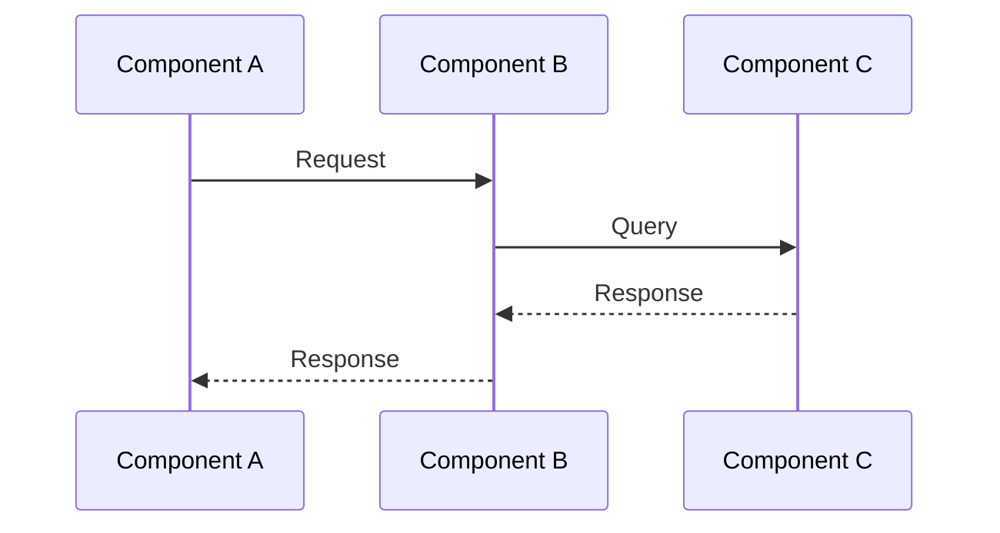

# Canonical Case Study Template

**Version**: 1.0  
**Last Updated**: December 19, 2025  
**Purpose**: Standardized template for all system design case studies

---

## Case Study Structure

Each case study follows this standardized structure to ensure consistency and interview-readiness.

### Core Documentation Files

1. **`README.md`** - Overview, learning objectives, case study structure
2. **`01_requirements.md`** - Functional and non-functional requirements
3. **`02_back-of-envelope.md`** - Capacity planning calculations
4. **`03_high-level-design.md`** - System architecture (HLD)
5. **`04_low-level-design.md`** - Detailed component design (LLD)
6. **`05_scalability.md`** - Scaling strategies and evolution
7. **`06_observability.md`** - Monitoring, logging, SLIs/SLOs
8. **`07_security.md`** - Security considerations
9. **`08_trade-offs.md`** - Design decisions and alternatives

### Diagrams Folder

All diagrams are co-located in `diagrams/` folder:

- **C4 Diagrams**:
  - `01_context-diagram.md` - System context (Level 1)
  - `02_container-diagram.md` - Container architecture (Level 2)
  - `03_component-diagram.md` - Component details (Level 3)

- **Sequence Diagrams**:
  - `sequence-diagrams/01_[flow-name].md` - Key interaction flows
  - `sequence-diagrams/02_[flow-name].md` - Additional flows

---

## Template Sections

### README.md Template

```markdown
# [System Name] Case Study

A comprehensive system design case study for building [system description].

## Overview

[2-3 sentence overview of what this system does and why it's important]

## Case Study Structure

[Standard structure listing]

## Key Design Highlights

### Problem Statement
- **What this system optimizes for**: [Primary optimization goal]
- **What is intentionally NOT optimized**: [Explicit trade-offs]
- **What breaks first at scale**: [First bottleneck]

### Interviewer Lens

**What signals senior-level thinking**:
- [Signal 1: e.g., "Evolutionary design approach"]
- [Signal 2: e.g., "Explicit trade-off reasoning"]
- [Signal 3: e.g., "Failure scenario consideration"]

**Common candidate mistakes**:
- [Mistake 1: e.g., "Jumping to microservices too early"]
- [Mistake 2: e.g., "Ignoring consistency guarantees"]
- [Mistake 3: e.g., "Over-engineering for scale not needed"]

## Learning Objectives

After studying this case study, you should be able to:
- [Objective 1]
- [Objective 2]
- [Objective 3]

## Related Topics

- [Links to relevant building blocks, patterns, principles]
```

---

### 01_requirements.md Template

```markdown
# [System Name] - Requirements

## Functional Requirements

1. **[Core Feature 1]**: [Description]
2. **[Core Feature 2]**: [Description]
3. **[Core Feature 3]**: [Description]

## Non-Functional Requirements

### Performance
- **Response Time**: [Target latency, e.g., <200ms p95]
- **Throughput**: [Target QPS/RPS]
- **Availability**: [Target uptime, e.g., 99.9%]

### Scalability
- **Scale Target**: [e.g., 100M users, 1M requests/second]
- **Growth Rate**: [e.g., 10x growth in 2 years]

### Consistency
- **Consistency Requirements**: [Strong/Eventual/Read-your-writes]
- **Data Criticality**: [What happens if data is stale?]

## Constraints

- **Budget**: [If relevant]
- **Time to Market**: [If relevant]
- **Team Size**: [If relevant]
- **Technical Constraints**: [Legacy systems, compliance, etc.]

## Out of Scope

- [Explicitly state what is NOT included]
- [Future considerations that are deferred]
```

---

### 02_back-of-envelope.md Template

```markdown
# [System Name] - Back-of-Envelope Calculations

## Assumptions

- [Assumption 1: e.g., 100M users]
- [Assumption 2: e.g., 10 requests/user/day]
- [Assumption 3: e.g., 1KB average request size]

## Storage Calculations

**Formula**: [Formula used]

**Calculation**:
```
[Step-by-step calculation]
= [Result]
```

## Bandwidth Calculations

[Similar structure]

## Server Capacity

[Similar structure]

## Key Metrics Summary

| Metric | Value |
|--------|-------|
| Total Storage | [X] TB |
| Peak QPS | [X] requests/second |
| Bandwidth | [X] Mbps |
| Servers Needed | [X] servers |

## Scaling Considerations

- **Read/Write Ratio**: [e.g., 100:1]
- **Cache Hit Ratio**: [e.g., 80%]
- **Data Growth**: [e.g., 3-5 years retention]
```

---

### 03_high-level-design.md Template

```markdown
# [System Name] - High-Level Design

## System Architecture

[Architecture diagram - Mermaid with ASCII fallback]

## Core Components

### Component 1: [Name]
- **Purpose**: [What it does]
- **Technology**: [If specified]
- **Scaling Strategy**: [How it scales]

### Component 2: [Name]
[Similar structure]

## Data Flow

### Write Flow
1. [Step 1]
2. [Step 2]
3. [Step 3]

### Read Flow
1. [Step 1]
2. [Step 2]
3. [Step 3]

## Key Design Decisions

### Decision 1: [Technology/Pattern Choice]
- **Rationale**: [Why this choice]
- **Alternatives Considered**: [What else was considered]
- **Trade-offs**: [What we gain/lose]

## Interviewer Lens

**This HLD demonstrates**:
- [Signal 1: e.g., "Clear separation of concerns"]
- [Signal 2: "Appropriate technology choices"]
- [Signal 3: "Scalability considerations"]

**Common mistakes avoided**:
- [Mistake 1: e.g., "Not over-engineering"]
- [Mistake 2: "Not ignoring failure scenarios"]
```

---

### 04_low-level-design.md Template

```markdown
# [System Name] - Low-Level Design

## Data Models

### [Entity Name]
```json
{
  "field1": "type",
  "field2": "type"
}
```

## API Design

### Endpoint 1: [Name]
- **Method**: [GET/POST/etc.]
- **Path**: `/api/v1/...`
- **Request**: [Structure]
- **Response**: [Structure]
- **Error Codes**: [List]

## Database Schema

```sql
CREATE TABLE [table_name] (
  [column definitions]
);
```

## Service Logic

### [Service/Component Name]

**Responsibilities**:
- [Responsibility 1]
- [Responsibility 2]

**Key Algorithms**:
- [Algorithm description if relevant]

## Consistency Considerations

- **Read Path**: [Consistency guarantees]
- **Write Path**: [Consistency guarantees]
- **Cache Invalidation**: [Strategy]
- **Replica Usage**: [When to use replicas vs primary]

## Interviewer Lens

**LLD Scope Note**:
> In interviews, only one service is typically decomposed to this level. This demonstrates understanding of component-level design without over-engineering.

**This LLD shows**:
- [Signal 1: e.g., "Clear component responsibilities"]
- [Signal 2: "Proper abstraction layers"]
```

---

### 05_scalability.md Template

```markdown
# [System Name] - Scalability

## Scaling Evolution

### Phase 1: [Initial Scale]
- **Traffic**: [QPS/users]
- **Architecture**: [Description]
- **Bottleneck**: [What breaks first]
- **Solution**: [How to address]

### Phase 2: [Next Scale]
[Similar structure]

### Phase 3: [Large Scale]
[Similar structure]

## Scaling Strategies

### Horizontal Scaling
- **When**: [Triggers]
- **How**: [Implementation]
- **Trade-offs**: [Costs/benefits]

### Vertical Scaling
- **When**: [Triggers]
- **Limitations**: [Why it's temporary]

## Database Scaling

- **Read Replicas**: [Strategy]
- **Sharding**: [If applicable]
- **Caching**: [Strategy]

## Interviewer Lens

> **Interview Note**: Skipping phases is a common mistake. Each phase exists to solve a specific bottleneck, not to follow trends.

**This demonstrates**:
- [Signal: "Evolutionary thinking"]
- [Signal: "Understanding of bottlenecks"]
```

---

### 06_observability.md Template

```markdown
# [System Name] - Observability

## SLIs and SLOs

### Service Level Indicators (SLIs)

- **Availability**: [Metric, e.g., uptime %]
- **Latency**: [Metric, e.g., p95 latency]
- **Error Rate**: [Metric, e.g., error %]
- **Throughput**: [Metric, e.g., QPS]

### Service Level Objectives (SLOs)

- **Availability**: [Target, e.g., 99.9%]
- **Latency**: [Target, e.g., <200ms p95]
- **Error Rate**: [Target, e.g., <0.1%]

## Monitoring Strategy

### Key Metrics
- [Metric 1]
- [Metric 2]
- [Metric 3]

### Alerting Strategy
- **Critical**: [What triggers critical alerts]
- **Warning**: [What triggers warnings]

## Logging Strategy

- **Structured Logging**: [Format]
- **Log Levels**: [What to log at each level]
- **Retention**: [How long to keep logs]

## Distributed Tracing

- **Trace Collection**: [How traces are collected]
- **Key Spans**: [Important operations to trace]

## Interviewer Lens

**This demonstrates**:
- [Signal: "Production-ready thinking"]
- [Signal: "Understanding of observability"]
```

---

### 07_security.md Template

```markdown
# [System Name] - Security

## Authentication

- **Method**: [OAuth, JWT, etc.]
- **Implementation**: [Details]

## Authorization

- **Model**: [RBAC, ABAC, etc.]
- **Enforcement**: [Where/how]

## Data Protection

- **Encryption at Rest**: [Strategy]
- **Encryption in Transit**: [Strategy]
- **PII Handling**: [How sensitive data is protected]

## Network Security

- **Trust Boundaries**: [Public vs private]
- **Firewall Rules**: [If relevant]
- **DDoS Protection**: [Strategy]

## Interviewer Lens

**Security considerations show**:
- [Signal: "Production awareness"]
- [Signal: "Defense in depth"]
```

---

### 08_trade-offs.md Template

```markdown
# [System Name] - Trade-offs

## Architecture Trade-offs

### Decision 1: [Technology/Pattern]
- **Chosen**: [What we chose]
- **Alternatives**: [What we didn't choose]
- **Trade-offs**: [What we gain/lose]

## Performance Trade-offs

### Consistency vs Availability
- **Choice**: [What we chose]
- **Rationale**: [Why]
- **Impact**: [What this means]

### Latency vs Throughput
[Similar structure]

## Cost Trade-offs

### Managed vs Self-Hosted
[Similar structure]

## Operational Trade-offs

### Complexity vs Flexibility
[Similar structure]

## Interviewer Lens

**Trade-off discussions demonstrate**:
- [Signal: "Understanding of engineering decisions"]
- [Signal: "Ability to reason about alternatives"]
```

---

## Sequence Diagram Template

```markdown
# [Flow Name] Sequence Diagram

## Flow Description

[Brief description of what this flow represents]

## Sequence Diagram



## ASCII Fallback

```text
A -> B: Request
B -> C: Query
C -> B: Response
B -> A: Response
```

## Error Scenarios

1. **Scenario 1**: [What happens]
2. **Scenario 2**: [What happens]

## Consistency Considerations

- [Consistency note if relevant]
- [Cache invalidation if relevant]
- [Replica usage if relevant]

## Interviewer Lens

**This flow demonstrates**:
- [Signal 1: e.g., "Stateless design"]
- [Signal 2: "Defensive validation"]
- [Signal 3: "Event-driven extensibility"]

**Interview Note**:
> [Any specific interview guidance, e.g., "In interviews, explain this flow slowly and clearly"]
```

---

## C4 Diagram Template

### Context Diagram

```markdown
# [System Name] - C4 Level 1: System Context

## System Context Diagram

[Diagram with Mermaid and ASCII fallback]

## Description

**Users**: [Who uses the system]

**System**: [What the system does]

**External Systems**: [What external dependencies exist]

## Interviewer Lens

**This context diagram shows**:
- [Signal: "Clear system boundaries"]
- [Signal: "Understanding of external dependencies"]
```

### Container Diagram

```markdown
# [System Name] - C4 Level 2: Container Architecture

## Container Diagram

[Diagram with Mermaid and ASCII fallback]

## Container Descriptions

[Description of each container]

## Trust Boundaries

- **Public Edge**: [What's exposed publicly]
- **Private Network**: [What's internal]

## Interviewer Lens

**This HLD demonstrates**:
- [Signal: "Appropriate technology choices"]
- [Signal: "Security awareness"]
- [Signal: "Scalability considerations"]
```

### Component Diagram

```markdown
# [System Name] - C4 Level 3: Component Details

## Component Diagram

[Diagram with Mermaid and ASCII fallback]

## Component Descriptions

[Description of each component]

## Interviewer Lens

> **LLD Scope Note**: In interviews, only one service is decomposed to this level. This prevents over-designing.

**This LLD shows**:
- [Signal: "Clear component responsibilities"]
- [Signal: "Proper abstraction layers"]
```

---

## Best Practices

### Interview Readiness

1. **Practice Verbal Explanation**: Be able to explain any diagram or flow clearly
2. **Know Trade-offs**: Understand why each decision was made
3. **Evolutionary Thinking**: Show how system evolves, not just final state
4. **Failure Scenarios**: Be ready to discuss what breaks and how to handle it

### Content Quality

1. **Be Specific**: Include actual numbers, not just "high" or "low"
2. **Show Evolution**: Demonstrate how system grows over time
3. **Explicit Trade-offs**: State what you're optimizing for and what you're not
4. **Consistency Notes**: Always discuss consistency guarantees around caches/replicas

### Common Mistakes to Avoid

1. **Over-engineering**: Don't jump to microservices too early
2. **Ignoring Consistency**: Always discuss consistency guarantees
3. **No Evolution**: Show how system grows, not just final architecture
4. **Missing Failure Scenarios**: Discuss what breaks and how to handle it

---

**Last Updated**: December 19, 2025

