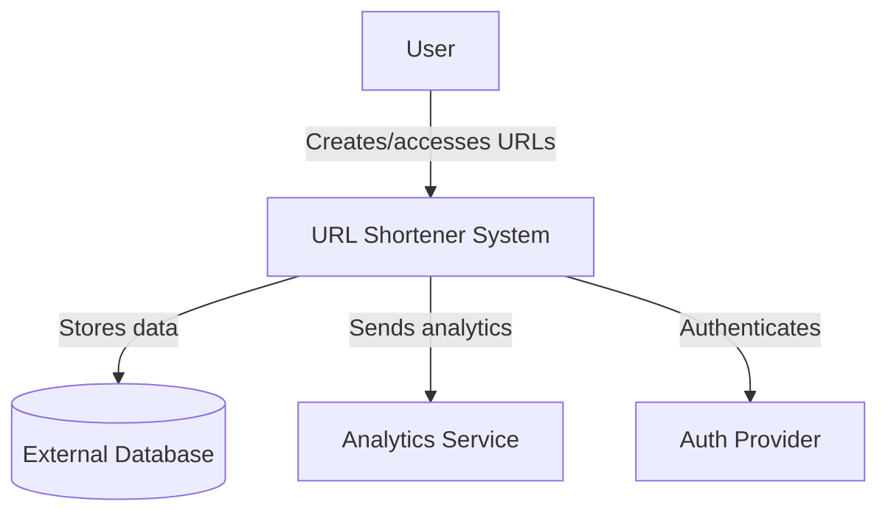
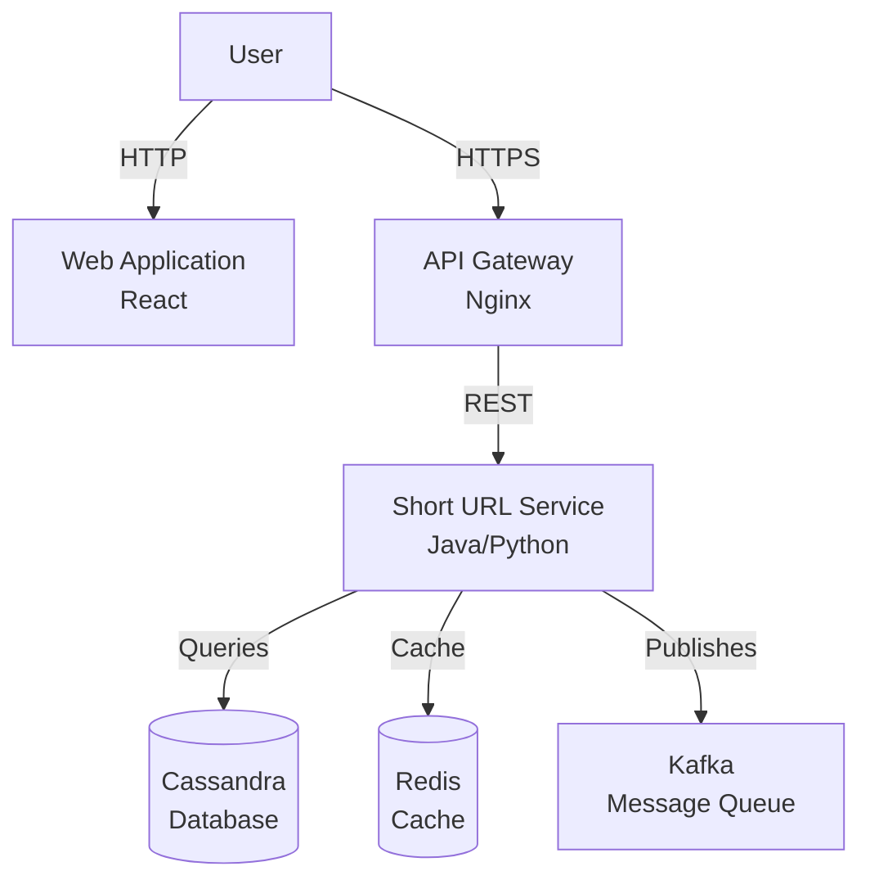

# C4 Model for System Design

## What is the C4 Model?

The C4 model is a **hierarchical visualization technique** for documenting software architecture. The name "C4" represents the four levels of detail: **Context, Container, Component, and Code**.

Unlike traditional UML diagrams that focus on implementation details, C4 diagrams emphasize **structure, relationships, and intent** at different levels of abstraction. This makes them ideal for system design interviews and architectural communication.

## Core Principle: Progressive Zoom

The C4 model follows a **"zoom in"** approach: start with the big picture and progressively add detail.

Each level answers specific questions about the system:

- **Level 1 (Context)**: What is this system and who uses it?
- **Level 2 (Container)**: What are the major building blocks?
- **Level 3 (Component)**: How is each container structured internally?
- **Level 4 (Code)**: How is it implemented? (Often skipped)

## The Four Levels Explained

### Level 1: System Context Diagram

**Purpose**: Show the system as a single unit and its external relationships.

**Shows**:

- The system boundary (your system as one box)
- Users (human actors who interact with the system)
- External systems (third-party services, APIs, databases)
- High-level data flows

**Example Context Diagram**:

**When to Use**: Initial system design discussions, stakeholder presentations, understanding system boundaries.

### Level 2: Container Diagram

**Purpose**: Break down the system into deployable runtime units.

**Important**: "Container" here means **runtime boundary** (application, service, database), not Docker containers.

**Shows**:

- Applications and services (web apps, APIs, microservices)
- Data stores (databases, caches, file systems)
- Message brokers and queues
- Technology choices (Java, Python, Redis, PostgreSQL)
- Communication patterns between containers

**Example Container Diagram**:

**When to Use**: Technical architecture discussions, deployment planning, technology selection.

---

*Next: Continue with [Level 3 and 4, Interview Strategy, and Best Practices](./06_c4-diagrams-part2.md).*
