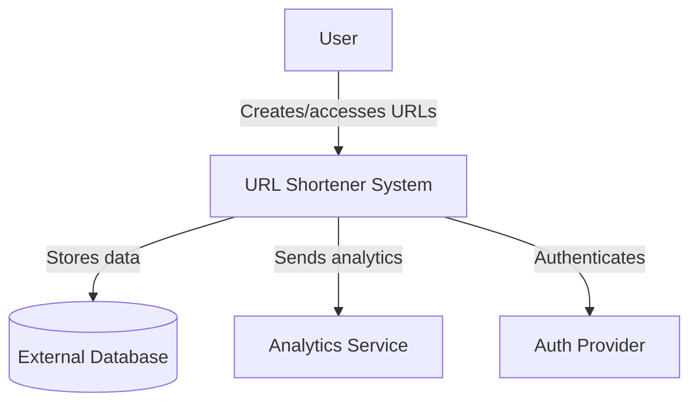
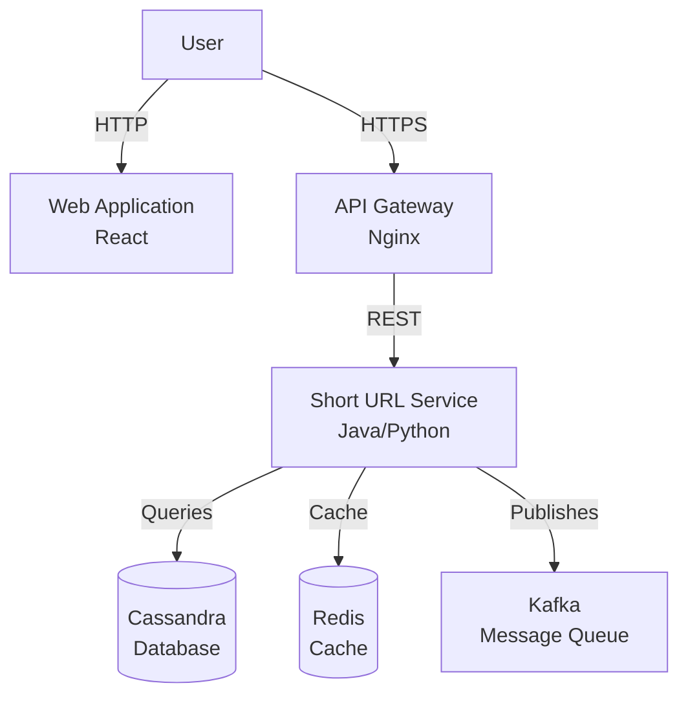
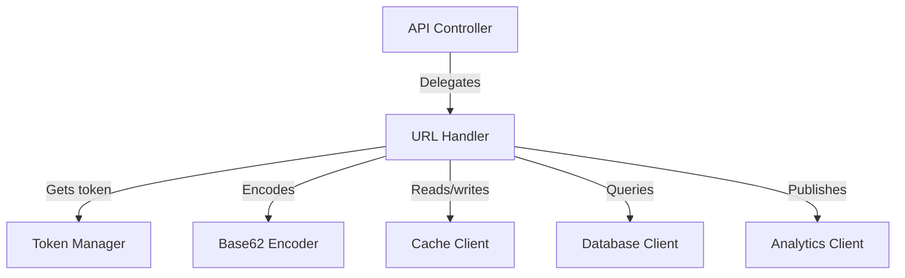

# C4 Model for System Design

## What is the C4 Model?

The C4 model is a **hierarchical visualization technique** for documenting software architecture. The name "C4" represents the four levels of detail: **Context, Container, Component, and Code**.

Unlike traditional UML diagrams that focus on implementation details, C4 diagrams emphasize **structure, relationships, and intent** at different levels of abstraction. This makes them ideal for system design interviews and architectural communication.

## Core Principle: Progressive Zoom

The C4 model follows a **"zoom in"** approach: start with the big picture and progressively add detail.

Each level answers specific questions about the system:

- **Level 1 (Context)**: What is this system and who uses it?
- **Level 2 (Container)**: What are the major building blocks?
- **Level 3 (Component)**: How is each container structured internally?
- **Level 4 (Code)**: How is it implemented? (Often skipped)

## The Four Levels Explained

### Level 1: System Context Diagram

**Purpose**: Show the system as a single unit and its external relationships.

**Shows**:

- The system boundary (your system as one box)
- Users (human actors who interact with the system)
- External systems (third-party services, APIs, databases)
- High-level data flows

**Example Context Diagram**:

**When to Use**: Initial system design discussions, stakeholder presentations, understanding system boundaries.

### Level 2: Container Diagram

**Purpose**: Break down the system into deployable runtime units.

**Important**: "Container" here means **runtime boundary** (application, service, database), not Docker containers.

**Shows**:

- Applications and services (web apps, APIs, microservices)
- Data stores (databases, caches, file systems)
- Message brokers and queues
- Technology choices (Java, Python, Redis, PostgreSQL)
- Communication patterns between containers

**Example Container Diagram**:

**When to Use**: Technical architecture discussions, deployment planning, technology selection.

### Level 3: Component Diagram

**Purpose**: Zoom into one container to show its internal structure.

**Shows**:

- Internal components (controllers, services, repositories)
- Component responsibilities
- Dependencies between components
- Data flow within the container

**Example Component Diagram (Short URL Service)**:

**When to Use**: Detailed design discussions, code organization, component-level architecture.

### Level 4: Code Diagram (Optional)

**Purpose**: Show classes, interfaces, and implementation details.

**Note**: This level is **rarely used** in system design interviews because:

- Code is the source of truth
- UML already covers this level
- Too detailed for high-level discussions

**When to Use**: Code reviews, detailed implementation documentation (seldom in system design).

## Why C4 for System Design Interviews?

### Advantages Over Traditional Approaches

| Aspect | C4 Model | Traditional UML |
| ------ | -------- | --------------- |
| **Learning Curve** | Low - intuitive hierarchy | High - many diagram types |
| **Interview Suitability** | Excellent - structured approach | Poor - too detailed |
| **Scalability** | Excellent - zoom in/out easily | Limited - fixed granularity |
| **Focus** | Structure and intent | Implementation details |
| **Real-world Adoption** | High - widely used | Medium - less common |

### Interview Strategy

1. **Start with Context**: Always begin with Level 1 to establish boundaries
2. **Zoom to Containers**: Break down into major components (Level 2)
3. **Detail Key Containers**: Deep dive into important containers (Level 3)
4. **Skip Code Level**: Avoid Level 4 unless specifically asked

## Creating C4 Diagrams

### Tools and Formats

**Recommended for This Repository**:

- **Mermaid**: Native support, version-controlled, renders in GitHub
- **PlantUML with C4-PlantUML**: Text-based, good for complex diagrams

**Other Options**:

- Draw.io / diagrams.net (visual editor)
- Structurizr (dedicated C4 tooling)
- Lucidchart / Miro (collaborative)

### Best Practices

1. **Always Start with Context**: Never jump to databases or APIs without context
2. **Use Consistent Notation**: Follow C4 conventions for shapes and relationships
3. **Document Decisions**: Include notes on technology choices and trade-offs
4. **Keep It Current**: Update diagrams as the system evolves
5. **Focus on Structure**: Emphasize relationships over implementation details

## Integration with Case Studies

Each case study in this repository includes C4 diagrams in the `diagrams/` folder:

- `01_context-diagram.md` - System context (Level 1)
- `02_container-diagram.md` - Container architecture (Level 2)
- `03_component-diagram.md` - Component details (Level 3)

See the [URL Shortener case study](../07_case-studies/05-url-shortener/diagrams/) for complete examples.

## Key Takeaways

1. **C4 provides a structured, hierarchical approach** to visualizing architecture
2. **Start broad, zoom in progressively** - Context → Container → Component
3. **Focus on structure and intent**, not implementation details
4. **Ideal for interviews** - clear, scalable, technology-agnostic
5. **Widely adopted** in industry for architectural documentation

---

*Next: Apply C4 diagrams in [URL Shortener case study](../07_case-studies/05-url-shortener/diagrams/01_context-diagram.md) or explore [other foundations](./README.md).*
