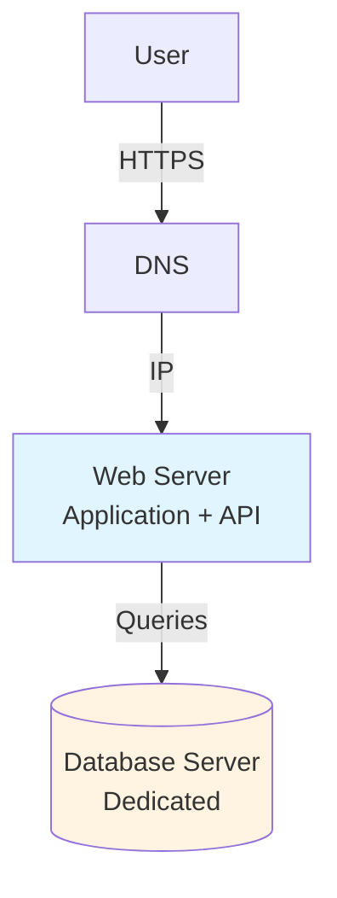

# Request Flow and Basic Architecture (Part 2)

## Separating Web Server and Database

### Why Separation Is Needed

As traffic grows, running everything on one server creates bottlenecks:

- **Resource Contention**: Web processing and database I/O compete for CPU and memory
- **Scaling Constraints**: Cannot scale web and database independently
- **Performance Issues**: Database queries slow down web request processing

### Improved Architecture

Separate web tier from data tier:



### Benefits of Separation

- ✅ **Independent Scaling**: Scale web and database separately
- ✅ **Better Performance**: Dedicated resources for each tier
- ✅ **Clear Separation**: Easier to optimize each component
- ✅ **Fault Isolation**: Database issues don't directly crash web server

## DNS in System Architecture

### What Is DNS?

Domain Name System (DNS) translates human-readable domain names to IP addresses.

**Example**:

- Domain: `api.example.com`
- IP Address: `192.168.1.100`

### Key Points

- **Third-Party Service**: DNS is typically managed by external providers (AWS Route 53, Cloudflare, etc.)
- **Caching**: DNS responses are cached to reduce lookup time
- **TTL (Time To Live)**: Controls how long DNS responses are cached
- **Multiple Record Types**: A records (IPv4), AAAA records (IPv6), CNAME (aliases)

### DNS Role in Scaling

DNS becomes critical for:

- **Load Distribution**: Route traffic to multiple servers
- **Geographic Routing**: Direct users to nearest data center
- **Failover**: Switch to backup servers during outages
- **CDN Integration**: Route static content to edge locations

## API Response Formats

### JSON as Standard

Modern APIs primarily use JSON (JavaScript Object Notation) for responses.

**Why JSON**:

- ✅ Lightweight: Smaller than XML
- ✅ Human-readable: Easy to debug
- ✅ Language-agnostic: Works with any programming language
- ✅ Efficient serialization: Fast parsing and generation

### REST Endpoint Example

```text
GET /users/123
```

**Example API Response**:

```json
{
  "id": 123,
  "name": "John Doe",
  "email": "john@example.com",
  "created_at": "2025-01-15T10:30:00Z"
}
```

## Traffic Sources

### Web Applications

- **Server-Side**: Java, Python, Node.js, .NET, etc.
- **Client-Side**: HTML, CSS, JavaScript
- **Rendering**: Server generates HTML or serves static files

### Mobile Applications

- **Communication**: HTTP/HTTPS protocol
- **Format**: JSON for API responses
- **No HTML**: Mobile apps render UI natively
- **API-First**: Backend serves data, not presentation

---

*Next: Continue with [Architectural Evolution Path and Key Takeaways](./07_request-flow-and-basic-architecture-part2-b.md).*
