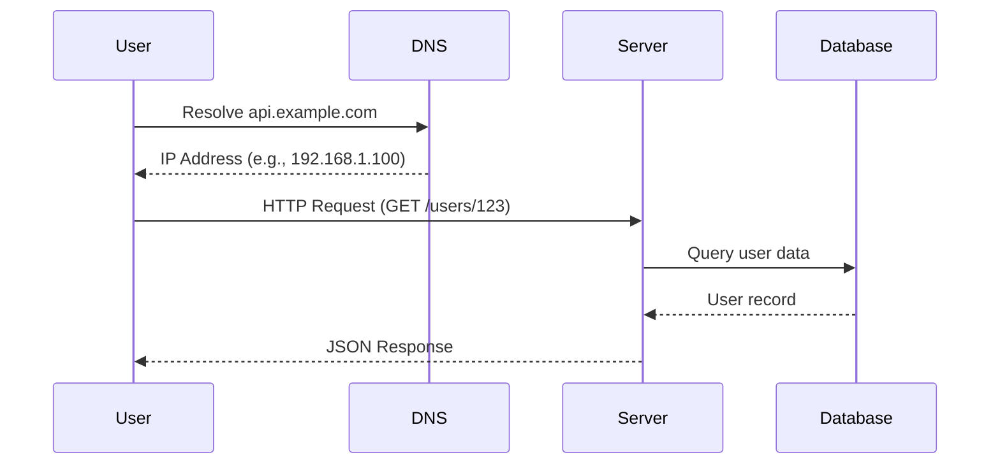
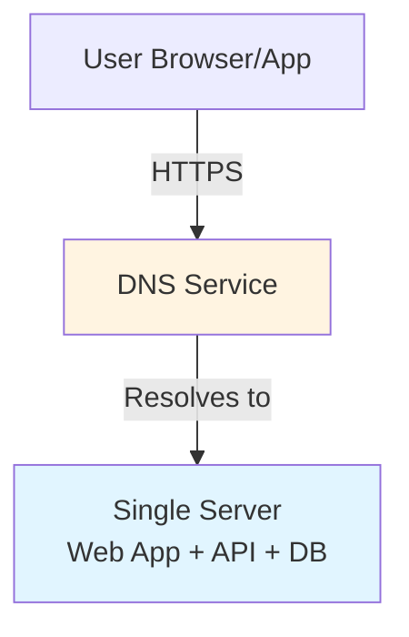
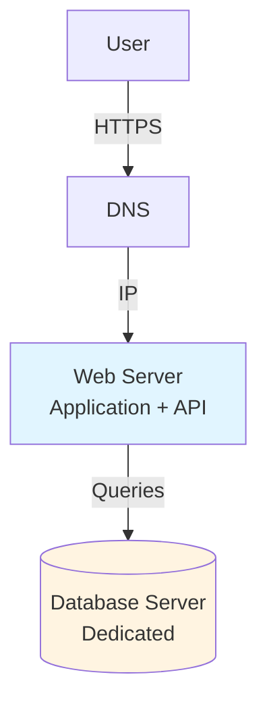

# Request Flow and Basic Architecture

## Understanding Request Flow

When a user interacts with a web application, a series of steps occur behind the scenes. Understanding this flow is fundamental to system design.

## Basic Request Flow

### Step-by-Step Process

1. **User Initiates Request**: User enters URL in browser or mobile app makes API call
2. **DNS Resolution**: Domain name (e.g., `api.example.com`) is resolved to IP address
3. **HTTP Request**: Browser/app sends HTTP request to the resolved IP address
4. **Server Processing**: Web server processes the request
5. **Response**: Server returns HTML (web) or JSON (API) response
6. **Client Rendering**: Browser renders HTML or app processes JSON

### Visual Flow



### ASCII Fallback

```text
User → DNS (resolve domain) → Server (process request) → Database (fetch data)
                                                              ↓
User ← JSON/HTML Response ← Server ← Query Results ←────────┘
```

## Single-Server Architecture

### Initial Setup

The simplest architecture runs everything on one machine:

**Components on Single Server**:

- Web application code
- API endpoints
- Database
- Static files (HTML, CSS, JavaScript)
- Business logic

### Architecture Diagram



### ASCII Fallback

```text
┌─────────────┐
│   User      │
└──────┬──────┘
       │ HTTPS Request
       ▼
┌─────────────┐
│     DNS     │ (Resolves domain to IP)
└──────┬──────┘
       │
       ▼
┌──────────────────────────────┐
│      Single Server           │
│  ┌────────────────────────┐  │
│  │  Web Application      │  │
│  │  API Endpoints         │  │
│  │  Database              │  │
│  │  Static Files          │  │
│  └────────────────────────┘  │
└──────────────────────────────┘
```

### Characteristics

**Advantages**:

- ✅ Simple to develop and deploy
- ✅ Low operational overhead
- ✅ Cost-effective for small scale
- ✅ Easy to understand and debug

**Limitations**:

- ❌ Single point of failure
- ❌ Limited scalability
- ❌ Resource contention (CPU, memory, I/O)
- ❌ Performance degrades with traffic

**When to Use**:

- Prototypes and MVPs
- Learning and development
- Very low traffic (< 1K users)
- Proof of concept systems

## Separating Web Server and Database

### Why Separation Is Needed

As traffic grows, running everything on one server creates bottlenecks:

- **Resource Contention**: Web processing and database I/O compete for CPU and memory
- **Scaling Constraints**: Cannot scale web and database independently
- **Performance Issues**: Database queries slow down web request processing

### Improved Architecture

Separate web tier from data tier:



### Benefits of Separation

- ✅ **Independent Scaling**: Scale web and database separately
- ✅ **Better Performance**: Dedicated resources for each tier
- ✅ **Clear Separation**: Easier to optimize each component
- ✅ **Fault Isolation**: Database issues don't directly crash web server

## DNS in System Architecture

### What Is DNS?

Domain Name System (DNS) translates human-readable domain names to IP addresses.

**Example**:

- Domain: `api.example.com`
- IP Address: `192.168.1.100`

### Key Points

- **Third-Party Service**: DNS is typically managed by external providers (AWS Route 53, Cloudflare, etc.)
- **Caching**: DNS responses are cached to reduce lookup time
- **TTL (Time To Live)**: Controls how long DNS responses are cached
- **Multiple Record Types**: A records (IPv4), AAAA records (IPv6), CNAME (aliases)

### DNS Role in Scaling

DNS becomes critical for:

- **Load Distribution**: Route traffic to multiple servers
- **Geographic Routing**: Direct users to nearest data center
- **Failover**: Switch to backup servers during outages
- **CDN Integration**: Route static content to edge locations

## API Response Formats

### JSON as Standard

Modern APIs primarily use JSON (JavaScript Object Notation) for responses.

**Why JSON**:

- ✅ Lightweight: Smaller than XML
- ✅ Human-readable: Easy to debug
- ✅ Language-agnostic: Works with any programming language
- ✅ Efficient serialization: Fast parsing and generation

**Example API Response**:

```json
{
  "id": 123,
  "name": "John Doe",
  "email": "john@example.com",
  "created_at": "2025-01-15T10:30:00Z"
}
```

### REST Endpoint Example

```
GET /users/123
```

Returns user information for user ID 123.

## Traffic Sources

### Web Applications

- **Server-Side**: Java, Python, Node.js, .NET, etc.
- **Client-Side**: HTML, CSS, JavaScript
- **Rendering**: Server generates HTML or serves static files

### Mobile Applications

- **Communication**: HTTP/HTTPS protocol
- **Format**: JSON for API responses
- **No HTML**: Mobile apps render UI natively
- **API-First**: Backend serves data, not presentation

## Key Takeaways

1. **Request Flow**: DNS → Server → Database → Response
2. **Start Simple**: Single-server architecture is fine for small scale
3. **Separate Concerns**: Split web and database as you grow
4. **DNS Matters**: Critical for routing and scaling
5. **JSON Standard**: Modern APIs use JSON for data exchange
6. **Plan Evolution**: Design with future separation in mind

---

*Next: Learn about [Scalability Principles](../../04_principles/03_scalability.md) or explore [DNS](../../05_building-blocks/01_dns.md) in detail.*

