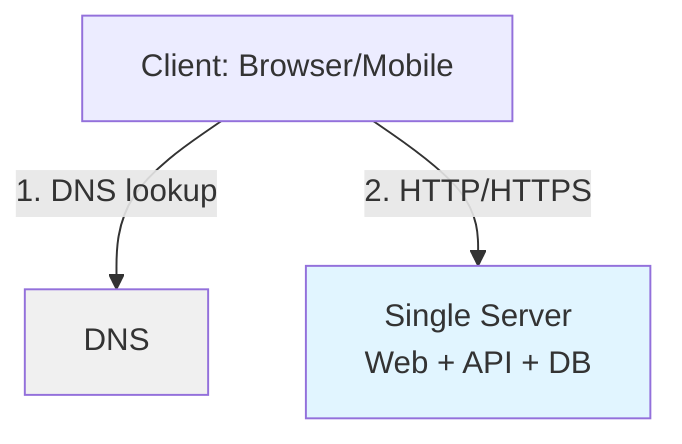
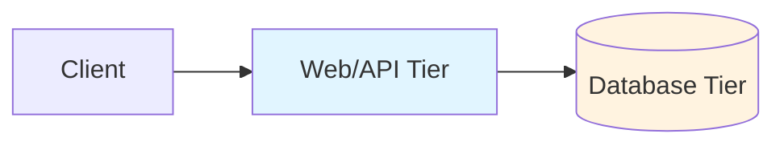

# Scaling Fundamentals (Part 1): Start Simple, Then Split Tiers

Scaling to millions of users rarely happens in one leap. Most real systems start small, then evolve as bottlenecks show up in production.

## The mindset

- Start with the simplest architecture that meets today's requirements.
- Measure (latency, error rate, saturation), then change the design.
- Add complexity only when it buys you something: reliability, performance, or cost control.

## Baseline architecture: single server

In a minimal deployment, one machine runs the web app, API, and database.



### ASCII fallback

```text
Client -> DNS (domain -> IP) -> Single Server
                              - Web / API
                              - Database
```

### Why it’s useful

- Fast to build and deploy (great for prototypes/MVPs).
- Easy mental model while you validate the product.

### What breaks first

- Single point of failure: one crash takes everything down.
- Resource contention: CPU, memory, disk I/O, and connections fight each other.
- Scaling ceiling: you can “scale up” only so far.

## Request flow (end to end)

1. User visits a domain like `api.example.com`.
2. DNS resolves it to an IP address.
3. Client sends an HTTP request to the server.
4. Server runs business logic and reads/writes the database.
5. Server returns HTML (web) or JSON (mobile/API clients).

DNS is typically a managed service; your app usually doesn’t host DNS servers.

## Traffic sources: web vs mobile

- Web: server may render HTML, while the browser runs JS.
- Mobile: client typically calls APIs and expects JSON responses.

Example endpoint:

```text
GET /users/12
```

Example response:

```json
{ "id": 12, "name": "Ada", "createdAt": "2025-01-15T10:30:00Z" }
```

## First evolution: split web tier and data tier

When load increases, your first big win is usually separating the application from the database.



### Benefits

- Independent scaling (add app servers without moving the database).
- Clearer operational boundaries (deploy app without touching data).
- Reduced contention (database gets stable CPU/disk).

### Signals it’s time

- App CPU is high but DB is mostly idle (or vice versa).
- DB latency spikes during traffic bursts.
- Deployments cause frequent downtime.

---

*Next: [Part 2: Database Choices and Scaling Strategies](./07_scaling-fundamentals-part2.md).*

