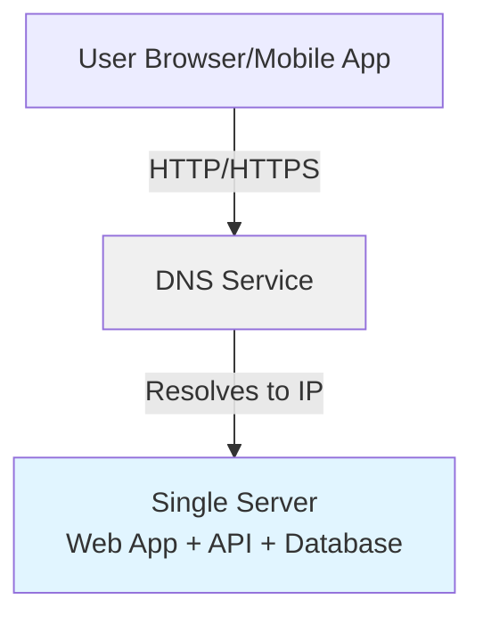

# Scaling Fundamentals: From Simple to Complex

## The Scaling Journey Philosophy

System design is not about building the perfect architecture from day one. Instead, it's an **iterative journey** that starts simple and evolves based on actual needs.

**Key Principle**: Begin with the simplest architecture that works, then evolve as requirements grow.

## Why Start Simple?

### Benefits of Starting Simple

- **Faster Time to Market**: Simple systems can be built and deployed quickly
- **Lower Initial Costs**: Minimal infrastructure investment
- **Easier to Understand**: Simple architectures are easier to debug and maintain
- **Proven Need**: Only add complexity when you have evidence it's needed

### When Simple is Enough

Simple single-server architectures are suitable for:

- **Prototypes and MVPs**: Testing ideas and validating concepts
- **Low Traffic Applications**: Systems with predictable, low user counts
- **Learning Projects**: Educational systems where complexity isn't the goal
- **Internal Tools**: Applications used by small teams

## The Baseline: Single Server Architecture

### Architecture Overview

In the simplest form, all components run on a single machine:



### ASCII Fallback

```text
User → DNS (resolves domain) → Single Server
                                ├─ Web Application
                                ├─ API Layer
                                └─ Database
```

### Components in Single Server Setup

**Client Layer**:
- Web browsers rendering HTML/CSS/JavaScript
- Mobile applications making API calls

**DNS Layer**:
- Third-party managed service (not hosted on your servers)
- Resolves domain names to IP addresses
- Example: `api.example.com` → `192.168.1.100`

**Application Server**:
- Handles HTTP/HTTPS requests
- Processes business logic
- Serves static files
- Manages database connections

**Data Storage**:
- Database running on the same server
- File system for static assets
- In-memory structures for temporary data

## Request Flow in Simple Architecture

### Step-by-Step Process

1. **User Initiates Request**: Accesses domain name (e.g., `api.example.com`)
2. **DNS Resolution**: DNS service resolves domain to server IP address
3. **HTTP Request**: Client sends HTTP request to resolved IP
4. **Server Processing**: Application server processes request
5. **Response**: Server returns HTML (web) or JSON (API)
6. **Client Rendering**: Browser or app renders the response

### Key Insight

DNS is typically a **managed third-party service**. Your infrastructure doesn't need to run DNS servers—you configure DNS records to point to your server IPs.

## Understanding Traffic Sources

### Web Applications

**Server-Side**:
- Programming languages: Java, Python, Node.js, C#, etc.
- Frameworks: Spring Boot, Django, Express, ASP.NET, etc.
- Responsibilities: Business logic, data processing, HTML generation

**Client-Side**:
- HTML for structure
- CSS for styling
- JavaScript for interactivity
- Rendered by the browser

### Mobile Applications

**Communication Pattern**:
- Uses HTTP/HTTPS protocol (same as web)
- Standard format: JSON for data exchange
- No HTML rendering on server
- Server focuses on business logic and data

**API Design**:
- RESTful endpoints
- JSON request/response format
- Stateless interactions

## API Response Format: Why JSON?

### JSON Characteristics

- **Lightweight**: Minimal overhead compared to XML
- **Human-Readable**: Easy to debug and inspect
- **Language-Agnostic**: Supported by all major programming languages
- **Efficient Parsing**: Fast serialization and deserialization

### Example API Response

```json
{
  "id": 12345,
  "name": "John Doe",
  "email": "john@example.com",
  "created_at": "2025-01-15T10:30:00Z"
}
```

### Why JSON Over Alternatives?

- **XML**: More verbose, slower parsing
- **Binary Formats**: Not human-readable, harder to debug
- **CSV**: Limited structure, no nested data
- **JSON**: Best balance of readability and efficiency

## The Evolution Path

As your system grows, you'll need to evolve:

1. **Separate Concerns**: Split web server from database
2. **Add Redundancy**: Multiple servers for availability
3. **Introduce Caching**: Reduce database load
4. **Scale Horizontally**: Add more servers
5. **Distribute Globally**: Multiple regions

Each step addresses specific bottlenecks identified through monitoring and analysis.

---

*Next: Learn about [Scalability Principles](../04_principles/03_scalability.md) or explore the [Scale from Zero to Million Users](../07_case-studies/01-scalefromzerotomillonusers/README.md) case study.*

