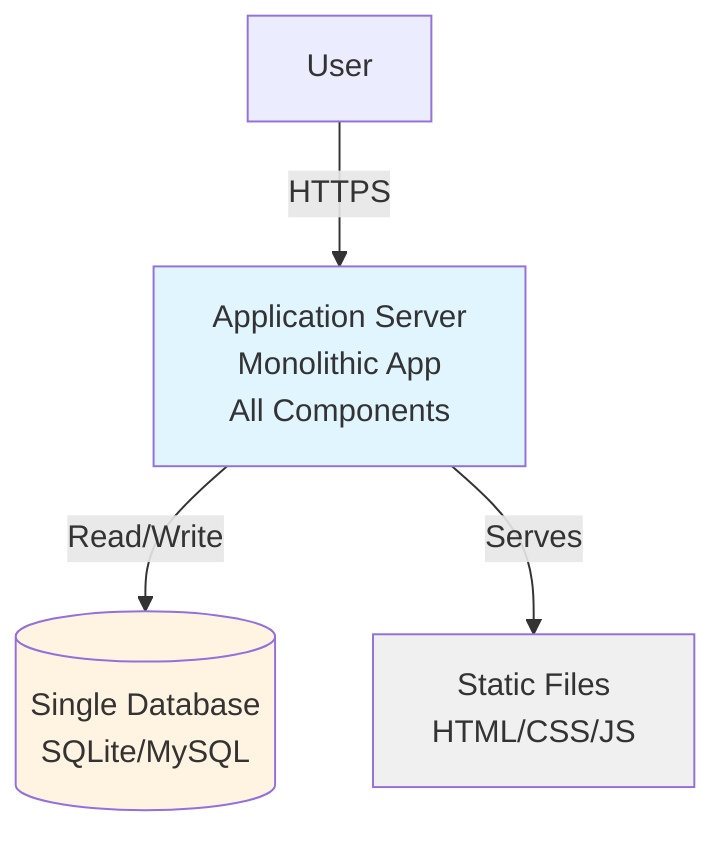

# Phase 1: Monolithic Architecture (0-1K Users)

## Architecture Overview

This diagram illustrates the initial monolithic architecture designed for small-scale deployment (0-1K users).



## ASCII Fallback

```text
┌──────┐
│ User │
└──┬───┘
   │ HTTPS
   ▼
┌─────────────────────────────┐
│   Application Server        │
│   ┌─────────────────────┐   │
│   │  Web Layer          │   │
│   │  Business Logic     │   │
│   │  Data Access        │   │
│   └─────────────────────┘   │
└───┬─────────────────────────┘
    │
    ├──► Database (SQLite/MySQL)
    └──► Static Files
```

## Components

### Application Server

- **Monolithic Application**: All components (web layer, business logic, data access) in single process
- **Single Instance**: One server handles all requests
- **Technology**: Any web framework (Node.js, Python Flask/Django, Java Spring Boot, .NET)

### Database

- **Single Database**: SQLite (development) or MySQL (production)
- **No Replication**: Single point of failure
- **Simple Schema**: Straightforward relational model

### Static Files

- **Local Storage**: Files served directly from application server
- **No CDN**: All content served from single location

## Characteristics

- ✅ **Simple**: Easy to develop and deploy
- ✅ **Low Cost**: Single server infrastructure
- ✅ **Fast Development**: No distributed system complexity
- ❌ **Single Point of Failure**: Server or database failure brings down entire system
- ❌ **Limited Scalability**: Cannot scale beyond single server capacity
- ❌ **No High Availability**: No redundancy

## When to Use

- Initial product launch
- Small user base (< 1K users)
- MVP (Minimum Viable Product)
- Prototype or proof of concept
- Low traffic applications

## Migration Path

When user base grows beyond 1K users, migrate to Phase 2 (Vertical Scaling) by:
- Upgrading server hardware
- Adding database read replicas
- Introducing basic caching

---

*Next: [Phase 2: Vertical Scaling](./05_phase2-vertical-scaling.md)*

