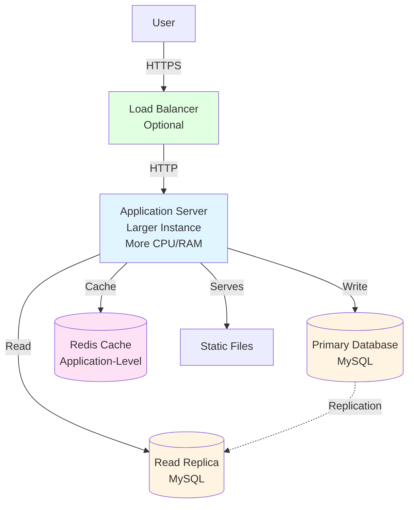

# Phase 2: Vertical Scaling (1K-100K Users)

## Architecture Overview

This diagram illustrates the vertical scaling architecture designed for medium-scale deployment (1K-100K users).



## ASCII Fallback

```text
┌──────┐
│ User │
└──┬───┘
   │ HTTPS
   ▼
┌──────────────┐
│ Load Balancer│ (Optional)
└──────┬───────┘
       │ HTTP
       ▼
┌─────────────────────────────┐
│   Application Server         │
│   (Larger Instance)         │
│   ┌─────────────────────┐   │
│   │  Web Layer          │   │
│   │  Business Logic     │   │
│   │  Data Access        │   │
│   │  Cache Client       │   │
│   └─────────────────────┘   │
└───┬─────────────────────────┘
    │
    ├──► Primary DB (Writes)
    ├──► Read Replica (Reads)
    ├──► Redis Cache
    └──► Static Files
```

## Components

### Application Server

- **Larger Instance**: Upgraded hardware (more CPU, RAM, storage)
- **Still Monolithic**: All components in single process
- **Single Instance**: One server, but more powerful
- **Cache Integration**: Application-level caching with Redis

### Database

- **Primary Database**: Handles all write operations
- **Read Replicas**: One or more replicas for read scaling
- **Replication**: Master-slave replication setup
- **Technology**: MySQL with replication

### Cache Layer

- **Redis/Memcached**: In-memory cache for frequently accessed data
- **Application-Level**: Cache managed by application code
- **Reduces Database Load**: Offloads read traffic from database

### Load Balancer (Optional)

- **Basic Load Balancing**: May be introduced for high availability
- **Health Checks**: Basic health monitoring
- **SSL Termination**: Handles HTTPS termination

## Characteristics

- ✅ **Better Performance**: More resources per request
- ✅ **Read Scaling**: Read replicas distribute read load
- ✅ **Cost-Effective**: Single server upgrade is cheaper than multiple servers
- ✅ **Improved Availability**: Read replicas provide some redundancy
- ❌ **Still Single Point of Failure**: Application server failure affects all users
- ❌ **Vertical Scaling Limits**: Hardware upgrade limits (CPU/RAM constraints)
- ❌ **Cost Increases**: Larger instances are more expensive

❗ **Critical Understanding**: Vertical scaling delays, but does not eliminate, the need for horizontal scaling. As traffic grows, you will eventually hit hardware limits and must move to multiple servers.

## Scaling Strategy

### Vertical Scaling Approach

- **Upgrade Hardware**: Increase CPU, RAM, storage
- **Database Optimization**: Add indexes, query optimization
- **Read Replicas**: Scale read operations horizontally
- **Caching**: Reduce database load with application-level cache

## When to Use

- Medium user base (1K-100K users)
- Predictable traffic patterns
- Cost-effective scaling before horizontal scaling
- Applications with read-heavy workloads
- When horizontal scaling infrastructure is not ready

## Migration Path

When user base grows beyond 100K users, migrate to Phase 3 (Horizontal Scaling) by:
- Adding multiple application server instances
- Implementing distributed caching
- Adding CDN for static content
- Introducing message queues

---

*Previous: [Phase 1: Monolithic](./04_phase1-monolithic.md)*  
*Next: [Phase 3: Horizontal Scaling](./06_phase3-horizontal-scaling.md)*

