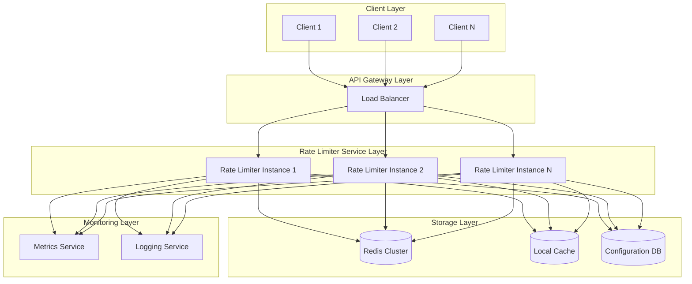

# Rate Limiter - High-Level Design

## System Architecture

The rate limiter is designed as a distributed service that can be deployed as a sidecar, middleware, or standalone service.

## Core Components

### 1. Rate Limiter Service

**Purpose**: Main service that enforces rate limits

**Responsibilities**:

- Receive rate limit check requests
- Execute rate limiting algorithms
- Return allow/deny decisions
- Update rate limit counters

**Characteristics**:

- Stateless design (all state in Redis)
- Horizontally scalable
- Low latency (<1ms p99)

### 2. Redis Cluster

**Purpose**: Distributed storage for rate limit counters

**Responsibilities**:

- Store rate limit counters with TTL
- Provide atomic operations for counter updates
- Support distributed rate limiting across instances

**Characteristics**:

- High throughput (millions of ops/second)
- Low latency (<1ms)
- Automatic TTL-based cleanup

### 3. Configuration Service

**Purpose**: Manage rate limit rules and policies

**Responsibilities**:

- Store rate limit configurations
- Provide configuration API
- Support dynamic configuration updates

**Characteristics**:

- Database-backed (MySQL/PostgreSQL)
- Cached in memory for fast access
- Support for versioning and rollback

### 4. Cache Layer

**Purpose**: In-memory cache for frequently accessed data

**Responsibilities**:

- Cache rate limit configurations
- Cache frequently accessed counters
- Reduce Redis load

**Characteristics**:

- Local in-memory cache (per instance)
- TTL-based expiration
- Cache-aside pattern

## Architecture Diagram

## Request Flow

### Rate Limit Check Flow

1. **Client Request**: Client sends request with rate limit key (user ID, IP, endpoint)
2. **Load Balancer**: Routes request to available rate limiter instance
3. **Configuration Lookup**: Rate limiter checks local cache for rate limit rules
4. **Counter Check**: Rate limiter checks Redis for current counter value
5. **Algorithm Execution**: Executes rate limiting algorithm (token bucket, sliding window, etc.)
6. **Decision**: Returns allow/deny decision
7. **Counter Update**: Updates counter in Redis if allowed
8. **Response**: Returns response with rate limit headers

### Distributed Rate Limiting

**Challenge**: Multiple rate limiter instances must enforce consistent limits

**Solution**: Use Redis for centralized counter storage

- All instances read/write to same Redis cluster
- Atomic operations ensure consistency
- Redis handles synchronization

## Rate Limiting Algorithms

### 1. Token Bucket

**How it works**:

- Bucket has capacity (max tokens)
- Tokens are added at fixed rate (refill rate)
- Request consumes one token
- Request allowed if token available

**Use cases**: Smooth rate limiting, burst handling

### 2. Sliding Window

**How it works**:

- Track requests in time window
- Window slides continuously
- Request allowed if count < limit

**Use cases**: Precise rate limiting, no burst allowance

### 3. Fixed Window

**How it works**:

- Fixed time window (e.g., 1 minute)
- Count requests in current window
- Request allowed if count < limit

**Use cases**: Simple rate limiting, lower accuracy acceptable

## Design Decisions

### Stateless Design

**Decision**: Rate limiter instances are stateless

**Rationale**:

- Enables horizontal scaling
- No state synchronization needed
- Easy to add/remove instances

**Trade-off**: All state in Redis (single point of dependency)

### Redis for Counters

**Decision**: Use Redis for rate limit counter storage

**Rationale**:

- High throughput and low latency
- Atomic operations for consistency
- TTL support for automatic cleanup
- Distributed support

**Trade-off**: Redis becomes critical dependency

### Local Cache

**Decision**: Use in-memory cache for configurations and hot counters

**Rationale**:

- Reduces Redis load
- Faster configuration lookup
- Better performance

**Trade-off**: Cache invalidation complexity

### Multiple Algorithms

**Decision**: Support multiple rate limiting algorithms

**Rationale**:

- Different use cases need different algorithms
- Flexibility for clients
- Can optimize per use case

**Trade-off**: Increased complexity

## High Availability

### Redundancy

- **Multiple Instances**: 100+ rate limiter instances
- **Redis Cluster**: 10 nodes with replication
- **Database Replicas**: Primary + 2 read replicas

### Failover

- **Graceful Degradation**: If rate limiter unavailable, allow requests (fail open)
- **Circuit Breaker**: Detect Redis failures and fail open
- **Health Checks**: Monitor instance health

### Data Consistency

- **Redis Atomic Operations**: Ensure counter updates are atomic
- **Eventual Consistency**: Acceptable for rate limit counters
- **Clock Synchronization**: Use Redis server time for timestamps

## Scalability

### Horizontal Scaling

- Add more rate limiter instances
- Add more Redis nodes
- Distribute load evenly

### Performance Optimization

- **Connection Pooling**: Reuse Redis connections
- **Batch Operations**: Batch counter updates when possible
- **Async Processing**: Non-blocking rate limit checks

## Security

### Authentication

- API key authentication for rate limiter service
- Service-to-service authentication

### Authorization

- Rate limit rules can be scoped to services/users
- Access control for configuration updates

### Abuse Prevention

- Rate limit the rate limiter itself
- Monitor for abuse patterns
- Alert on unusual traffic
