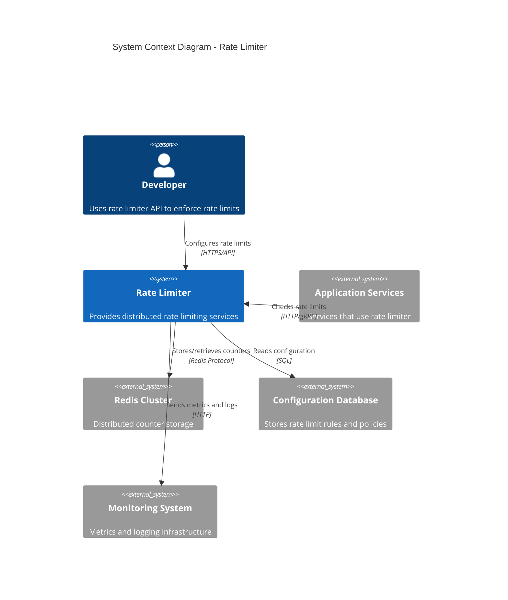

# Rate Limiter - System Context Diagram

## System Context (C4 Level 1)

This diagram shows the Rate Limiter system and its interactions with users and external systems.



## ASCII Fallback

```text
┌──────────┐
│ Developer│
└────┬─────┘
     │ Configures
     │
     ▼
┌─────────────────┐
│  Rate Limiter   │
│     System       │
└───┬─────────┬───┘
    │         │
    │         │
    ▼         ▼
┌─────────┐ ┌──────────────┐
│  Redis  │ │ Configuration│
│ Cluster │ │   Database   │
└─────────┘ └──────────────┘
    │
    │
    ▼
┌─────────────────┐
│   Application   │
│    Services     │
└─────────────────┘
```

## Key Relationships

- **Developers** configure rate limits via API
- **Application Services** check rate limits for incoming requests
- **Rate Limiter** uses Redis for distributed counter storage
- **Rate Limiter** reads configuration from database
- **Rate Limiter** sends metrics and logs to monitoring system

## External Systems

- **Application Services**: Services that need rate limiting (APIs, microservices)
- **Redis Cluster**: Distributed storage for rate limit counters
- **Configuration Database**: Stores rate limit rules and policies
- **Monitoring System**: Collects metrics, logs, and traces

