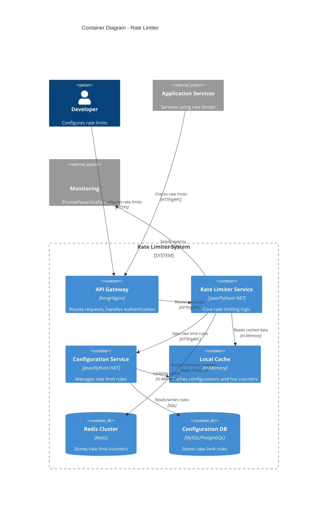

# Rate Limiter - Container Diagram

## Container Diagram (C4 Level 2)

This diagram shows the high-level technical building blocks (containers) that make up the Rate Limiter system.



## ASCII Fallback

```text
┌──────────┐      ┌─────────────────┐
│Developer │      │   Application   │
│          │      │    Services     │
└────┬─────┘      └────────┬────────┘
     │                     │
     │                     │
     ▼                     ▼
┌─────────────────────────────┐
│      API Gateway            │
└────────────┬────────────────┘
             │
     ┌───────┴────────┐
     │                │
     ▼                ▼
┌──────────┐    ┌──────────────┐
│  Rate    │    │Configuration │
│ Limiter  │    │   Service    │
│ Service  │    └──────┬────────┘
└────┬─────┘           │
     │                 │
     ├────────┬────────┤
     │        │        │
     ▼        ▼        ▼
┌──────┐ ┌────────┐ ┌──────────┐
│Cache │ │ Redis  │ │Database  │
└──────┘ └────────┘ └──────────┘
```

## Key Containers

1. **API Gateway**: Entry point, routing, authentication
2. **Rate Limiter Service**: Core rate limiting logic
3. **Configuration Service**: Manages rate limit rules
4. **Local Cache**: In-memory cache for performance
5. **Redis Cluster**: Distributed counter storage
6. **Configuration Database**: Persistent rule storage

## Container Responsibilities

- **API Gateway**: Routes requests, handles authentication, load balancing
- **Rate Limiter Service**: Executes rate limiting algorithms, makes allow/deny decisions
- **Configuration Service**: Manages rate limit rules, provides configuration API
- **Local Cache**: Caches frequently accessed configurations and counters
- **Redis Cluster**: Stores rate limit counters with TTL, provides atomic operations
- **Configuration Database**: Persists rate limit rules, supports versioning

