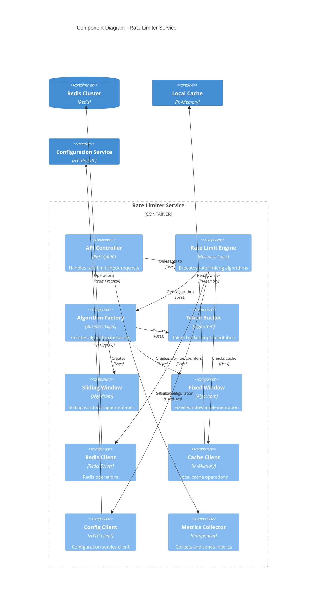

# Rate Limiter - Component Diagram

## Component Diagram (Rate Limiter Service)

This diagram shows the internal components of the Rate Limiter Service container.



## ASCII Fallback

```text
┌─────────────────────────────────┐
│     Rate Limiter Service        │
│                                 │
│  ┌──────────────┐              │
│  │ API Controller│              │
│  └──────┬───────┘               │
│         │                       │
│  ┌──────▼──────────┐           │
│  │ Rate Limit      │           │
│  │ Engine          │           │
│  └──────┬──────────┘           │
│         │                       │
│    ┌────▼────┐                 │
│    │Algorithm│                 │
│    │ Factory │                 │
│    └────┬────┘                 │
│         │                       │
│    ┌────▼────┐  ┌──────┐       │
│    │ Token   │  │Sliding│      │
│    │ Bucket  │  │Window │      │
│    └────┬────┘  └───┬──┘       │
│         │           │          │
│    ┌────▼───────────▼──┐       │
│    │  Redis Client    │        │
│    └────┬─────────────┘       │
│         │                      │
│    ┌────▼────┐  ┌──────┐      │
│    │ Cache   │  │Config│      │
│    │ Client  │  │Client│      │
│    └─────────┘  └──────┘      │
└────────┬───────────┬───────────┘
         │           │
    ┌────▼───┐  ┌───▼────┐
    │ Redis  │  │Config  │
    │Cluster │  │Service │
    └────────┘  └────────┘
```

## Component Responsibilities

### API Controller

- Receives rate limit check requests
- Validates input parameters
- Returns rate limit decisions
- Handles errors and exceptions

### Rate Limit Engine

- Orchestrates rate limiting process
- Selects appropriate algorithm
- Executes algorithm
- Makes allow/deny decisions

### Algorithm Factory

- Creates algorithm instances based on rule type
- Manages algorithm lifecycle
- Provides algorithm abstraction

### Algorithm Components

- **Token Bucket**: Implements token bucket algorithm
- **Sliding Window**: Implements sliding window algorithm
- **Fixed Window**: Implements fixed window algorithm

### Redis Client

- Manages Redis connections
- Performs counter operations
- Handles connection pooling
- Implements retry logic

### Cache Client

- Manages local in-memory cache
- Implements cache-aside pattern
- Handles cache invalidation
- Manages TTL

### Config Client

- Communicates with configuration service
- Fetches rate limit rules
- Handles configuration updates
- Implements caching

### Metrics Collector

- Collects rate limit metrics
- Sends metrics to monitoring system
- Tracks performance indicators

## Component Interactions

1. **Request Flow**: API Controller → Rate Limit Engine → Algorithm → Redis Client
2. **Configuration Flow**: Rate Limit Engine → Config Client → Configuration Service
3. **Cache Flow**: Rate Limit Engine → Cache Client → Local Cache
4. **Metrics Flow**: API Controller → Metrics Collector → Monitoring System
