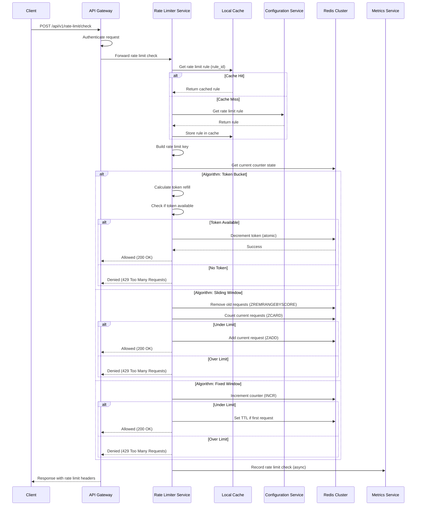

# Rate Limit Check Flow - Sequence Diagram

## Rate Limit Check Sequence

This diagram shows the flow when a client requests a rate limit check.



## ASCII Fallback

```text
Client    API Gateway   Rate Limiter   Cache    Config Service   Redis    Metrics
  │            │              │          │            │            │         │
  │ POST /rate-limit/check   │          │            │            │         │
  ├───────────>│              │          │            │            │         │
  │            │ Authenticate │          │            │            │         │
  │            ├─────────────>│          │            │            │         │
  │            │              │ Get rule │            │            │         │
  │            │              ├─────────>│            │            │         │
  │            │              │          │            │            │         │
  │            │              │ Cache Hit│            │            │         │
  │            │              │<──────────┤            │            │         │
  │            │              │          │            │            │         │
  │            │              │ Get counter           │            │         │
  │            │              ├───────────────────────────────────>│         │
  │            │              │<──────────────────────────────────┤         │
  │            │              │          │            │            │         │
  │            │              │ Execute algorithm                  │         │
  │            │              │          │            │            │         │
  │            │              │ Update counter                      │         │
  │            │              ├───────────────────────────────────>│         │
  │            │              │<──────────────────────────────────┤         │
  │            │              │          │            │            │         │
  │            │              │ Record metrics                     │         │
  │            │              ├──────────────────────────────────────────────>│
  │            │<─────────────┤          │            │            │         │
  │<───────────┤              │          │            │            │         │
```

## Flow Description

1. **Client sends request** to API Gateway with rate limit check
2. **API Gateway authenticates** the request
3. **Rate Limiter gets rule** from cache or configuration service
4. **Rate Limiter builds key** from request parameters
5. **Rate Limiter gets counter** from Redis
6. **Rate Limiter executes algorithm** (token bucket, sliding window, or fixed window)
7. **Rate Limiter updates counter** in Redis if allowed
8. **Rate Limiter records metrics** asynchronously
9. **Response returned** to client with rate limit headers

## Error Scenarios

- **Redis Unavailable**: Fail-open, allow request
- **Configuration Missing**: Fail-open, allow request
- **Invalid Request**: Return 400 Bad Request
- **Authentication Failed**: Return 401 Unauthorized

