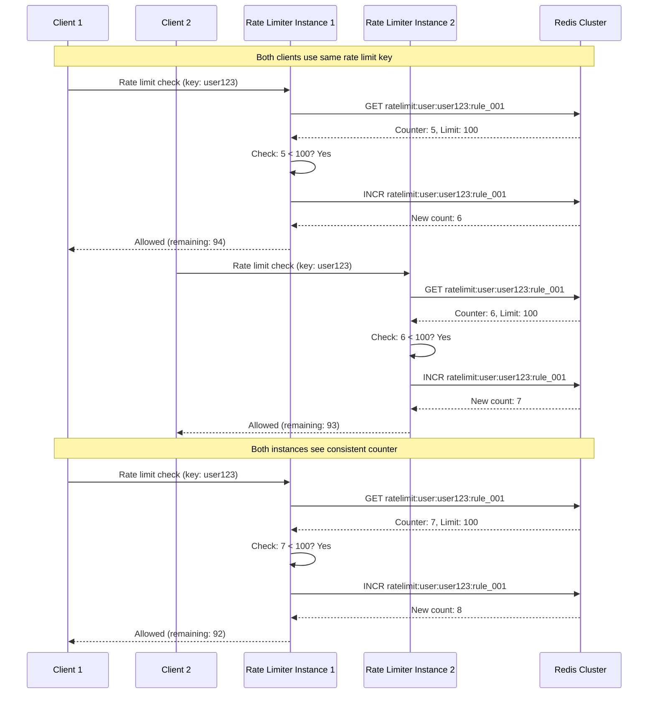

# Distributed Rate Limiting - Sequence Diagram

## Distributed Rate Limiting Sequence

This diagram shows how multiple rate limiter instances maintain consistent rate limits.



## ASCII Fallback

```text
Client 1   Client 2   RL Instance 1   RL Instance 2   Redis Cluster
   │          │            │               │              │
   │          │            │               │              │
   │ Check    │            │               │              │
   ├─────────>│            │               │              │
   │          │            │ GET counter   │              │
   │          │            ├───────────────┼─────────────>│
   │          │            │               │              │
   │          │            │<──────────────┼──────────────┤
   │          │            │ Counter: 5    │              │
   │          │            │               │              │
   │          │            │ INCR          │              │
   │          │            ├───────────────┼─────────────>│
   │          │            │<──────────────┼──────────────┤
   │          │            │ New: 6        │              │
   │          │<───────────┤               │              │
   │          │            │               │              │
   │          │ Check      │               │              │
   │          ├───────────────────────────>│              │
   │          │            │               │ GET counter  │
   │          │            │               ├─────────────>│
   │          │            │               │<─────────────┤
   │          │            │               │ Counter: 6   │
   │          │            │               │              │
   │          │            │               │ INCR         │
   │          │            │               ├─────────────>│
   │          │            │               │<─────────────┤
   │          │            │               │ New: 7      │
   │          │<───────────────────────────┤              │
```

## Flow Description

1. **Multiple instances** share same Redis cluster
2. **All instances** read/write to same counter key
3. **Redis atomic operations** ensure consistency
4. **Counter increments** are atomic across instances
5. **Consistent rate limiting** across all instances

## Consistency Guarantees

- **Atomic Operations**: Redis INCR is atomic
- **Single Source of Truth**: Redis is authoritative
- **Eventual Consistency**: Small window acceptable
- **Accuracy**: ±1% accuracy acceptable

## Benefits

- **Distributed**: Works across multiple instances
- **Consistent**: Same limits enforced everywhere
- **Scalable**: Add more instances easily
- **Simple**: No complex synchronization needed

