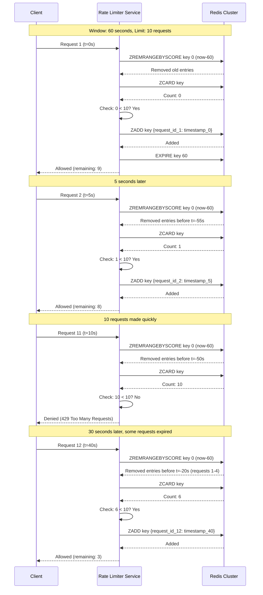

# Sliding Window Algorithm - Sequence Diagram

## Sliding Window Implementation Sequence

This diagram shows the detailed flow of the sliding window rate limiting algorithm.



## ASCII Fallback

```text
Client    Rate Limiter   Redis Cluster
  │            │              │
  │ Request 1 (t=0s)          │
  ├───────────>│              │
  │            │ Remove old   │
  │            ├─────────────>│
  │            │<─────────────┤
  │            │ Count: 0     │
  │            ├─────────────>│
  │            │<─────────────┤
  │            │ Add request  │
  │            ├─────────────>│
  │<───────────┤              │
  │            │              │
  │ Request 2 (t=5s)          │
  ├───────────>│              │
  │            │ Remove old   │
  │            ├─────────────>│
  │            │<─────────────┤
  │            │ Count: 1     │
  │            ├─────────────>│
  │            │<─────────────┤
  │            │ Add request  │
  │            ├─────────────>│
  │<───────────┤              │
  │            │              │
  │ Request 11 (t=10s)         │
  ├───────────>│              │
  │            │ Remove old   │
  │            ├─────────────>│
  │            │<─────────────┤
  │            │ Count: 10    │
  │            ├─────────────>│
  │            │<─────────────┤
  │            │ Over limit   │
  │<───────────┤              │
  │ Denied     │              │
```

## Flow Description

1. **Remove Old Entries**: Remove requests outside the sliding window
2. **Count Current Requests**: Count requests within the window
3. **Check Limit**: Compare count with limit
4. **Add Request**: If under limit, add current request
5. **Set TTL**: Set expiration to window duration

## Key Operations

### ZREMRANGEBYSCORE

Removes entries with scores (timestamps) outside the window:

```text
ZREMRANGEBYSCORE key 0 (current_time - window_seconds)
```

### ZCARD

Counts current entries in the sorted set:

```text
ZCARD key
```

### ZADD

Adds current request with timestamp as score:

```text
ZADD key {request_id: current_timestamp}
```

### EXPIRE

Sets TTL for automatic cleanup:

```text
EXPIRE key window_seconds
```

## Advantages

- **Accurate**: Precise rate limiting within window
- **No Burst**: No burst at window boundary
- **Smooth**: Continuous sliding window

## Trade-offs

- **Memory**: More memory for sorted sets
- **Complexity**: More complex operations
- **Latency**: Slightly higher latency than fixed window
