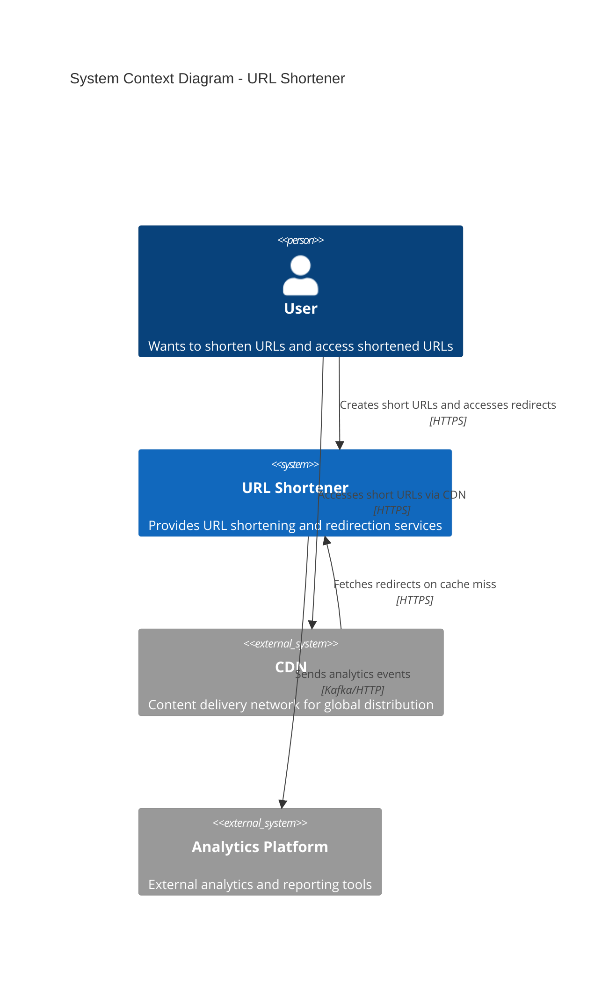

# URL Shortener - C4 Level 1: System Context

## System Context Diagram

The system context diagram shows the URL Shortener system and its relationships with users and external systems.



## ASCII Fallback

```text
┌─────────┐
│  User   │
└────┬────┘
     │ Creates short URLs
     │ Accesses redirects
     │
     ▼
┌─────────────────────┐
│  URL Shortener      │
│  System             │
└────┬────────────────┘
     │
     │ Sends analytics
     ▼
┌─────────────────────┐
│  Analytics Platform │
└─────────────────────┘

┌─────────┐
│  User   │
└────┬────┘
     │
     │ Accesses via CDN
     ▼
┌─────────┐
│   CDN   │
└────┬────┘
     │
     │ Cache miss
     ▼
┌─────────────────────┐
│  URL Shortener      │
└─────────────────────┘
```

## Description

**Users**: End users who want to shorten long URLs or access shortened URLs.

**URL Shortener System**: The core system that provides:

- URL shortening functionality
- URL redirection services
- Analytics and monitoring

**CDN**: Content delivery network that caches redirects at edge locations for low latency.

**Analytics Platform**: External system for processing analytics events and generating reports.

---

*Next: [Container Diagram](./02_container-diagram.md)*
