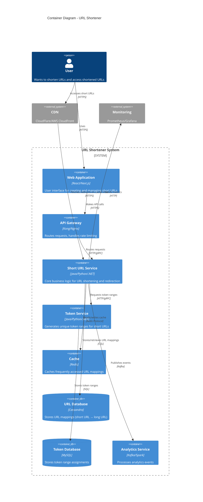

# URL Shortener - C4 Level 2: Container Architecture

## Container Diagram

The container diagram shows the high-level technical building blocks (containers) that make up the URL Shortener system.



## ASCII Fallback

```
┌─────────┐
│  User   │
└────┬────┘
     │
     ├─────────────────┐
     │                 │
     ▼                 ▼
┌──────────┐      ┌─────────┐
│ Web App  │      │   CDN   │
└────┬─────┘      └────┬────┘
     │                 │
     ▼                 │
┌──────────────┐       │
│ API Gateway  │       │
└──────┬───────┘       │
       │               │
       ▼               │
┌──────────────────────┴──────┐
│  Short URL Service           │
└──────┬───────────────────────┘
       │
       ├──────────┬──────────┬──────────┐
       │          │          │          │
       ▼          ▼          ▼          ▼
┌─────────┐ ┌──────────┐ ┌──────┐ ┌──────────┐
│  Cache  │ │Cassandra │ │Token │ │Analytics│
│ (Redis) │ │ Database │ │  Svc  │ │ Service │
└─────────┘ └──────────┘ └───┬──┘ └──────────┘
                             │
                             ▼
                        ┌─────────┐
                        │  MySQL  │
                        │Database │
                        └─────────┘
```

## Container Descriptions

**Web Application**: User-facing web interface for creating and managing short URLs.

**API Gateway**: Entry point that handles routing, rate limiting, authentication, and load balancing.

**Short URL Service**: Core service that:

- Generates short URLs from token ranges
- Stores URL mappings
- Retrieves long URLs for redirection
- Publishes analytics events

**Token Service**: Service that assigns unique token ranges to Short URL Service instances.

**Cache (Redis)**: In-memory cache for frequently accessed URL mappings to reduce database load.

**URL Database (Cassandra)**: Primary storage for URL mappings, optimized for high write throughput and horizontal scaling.

**Token Database (MySQL)**: Relational database for token range assignments, ensuring ACID guarantees.

**Analytics Service**: Processes analytics events from Kafka and generates reports.

---

*Previous: [Context Diagram](./01_context-diagram.md) | Next: [Component Diagram](./03_component-diagram.md)*
