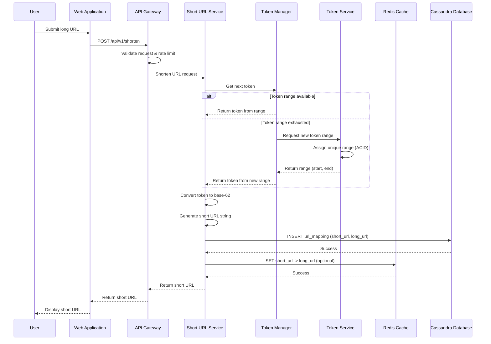

# Sequence Diagram - URL Shortening Flow

## Shortening Flow Sequence

This diagram shows the step-by-step flow when a user creates a short URL.



## ASCII Fallback

```
User → WebApp → API → Service → TokenMgr → TokenSvc
                              ↓
                           Cache
                              ↓
                            DB

1. User submits long URL
2. API validates and rate limits
3. Service requests token
4. If range exhausted, request new range from Token Service
5. Convert token to base-62
6. Store mapping in database
7. Optionally cache mapping
8. Return short URL to user
```

## Key Interactions

1. **Request Validation**: API Gateway validates input and applies rate limiting
2. **Token Generation**: Service gets token from current range or requests new range
3. **Base-62 Encoding**: Numeric token converted to short URL string
4. **Storage**: URL mapping stored in Cassandra database
5. **Caching**: Mapping optionally cached in Redis for fast retrieval
6. **Response**: Short URL returned to user

---

*Next: [Redirection Flow](./02_redirection-flow.md)*
