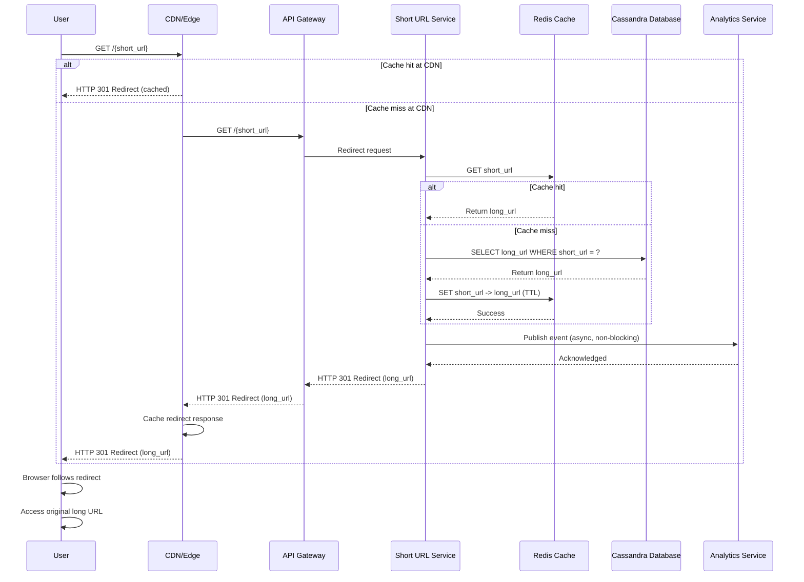

# Sequence Diagram - URL Redirection Flow

## Redirection Flow Sequence

This diagram shows the step-by-step flow when a user accesses a short URL.



## ASCII Fallback

```text
User → CDN → API → Service → Cache → DB
                    ↓
                Analytics

1. User requests short URL via CDN
2. CDN checks cache
3. If miss, request goes to API
4. Service checks Redis cache
5. If miss, query Cassandra database
6. Cache result in Redis
7. Publish analytics event (async)
8. Return HTTP 301 redirect
9. CDN caches redirect
10. User's browser follows redirect
```

## Key Interactions

1. **CDN Caching**: First layer of caching at edge locations
2. **Cache Lookup**: Redis cache checked before database query
3. **Database Query**: Cassandra lookup if cache miss
4. **Cache Update**: Result cached for future requests
5. **Analytics**: Event published asynchronously (non-blocking)
6. **Redirect Response**: HTTP 301 redirect returned
7. **Browser Redirect**: User's browser automatically follows redirect

## Performance Optimizations

- **CDN Cache**: Reduces latency for popular URLs
- **Redis Cache**: Reduces database load (85% hit ratio target)
- **Async Analytics**: Doesn't block redirect response
- **HTTP 301**: Permanent redirect, browser caches redirect

---

*Previous: [Shortening Flow](./01_shortening-flow.md) | Next: [Token Range Assignment](./03_token-range-assignment.md)*
