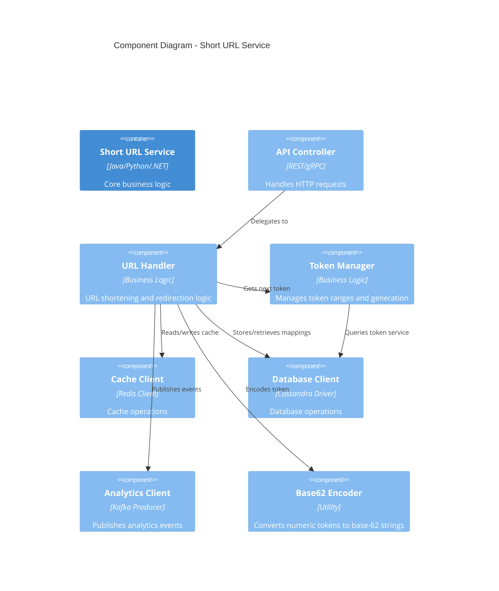

# URL Shortener - C4 Level 3: Component Details

## Component Diagram - Short URL Service

This diagram shows the internal components of the Short URL Service container.



## ASCII Fallback

```
┌─────────────────────────────────────┐
│   Short URL Service Container       │
│                                     │
│  ┌──────────────┐                  │
│  │ API Controller│                  │
│  └──────┬───────┘                  │
│         │                           │
│         ▼                           │
│  ┌──────────────┐                  │
│  │ URL Handler  │                  │
│  └──┬───────┬───┘                  │
│     │       │                       │
│     ├───────┼───────┬───────────────┤
│     │       │       │               │
│     ▼       ▼       ▼               │
│  ┌─────┐ ┌─────┐ ┌──────────────┐ │
│  │Token│ │Base │ │   Analytics  │ │
│  │Mgr  │ │62   │ │   Client     │ │
│  └──┬──┘ │Enc  │ └──────────────┘ │
│     │    └─────┘                  │
│     │                              │
│     ├──────────┬───────────────────┤
│     │          │                   │
│     ▼          ▼                   │
│  ┌──────┐  ┌──────────┐           │
│  │Cache │  │Database  │           │
│  │Client│  │ Client   │           │
│  └──────┘  └──────────┘           │
└─────────────────────────────────────┘
```

## Component Descriptions

**API Controller**: Handles incoming HTTP/gRPC requests, validates input, and returns responses.

**URL Handler**: Core business logic component that:
- Processes URL shortening requests
- Handles URL redirection requests
- Coordinates with other components

**Token Manager**: Manages token ranges:
- Tracks current token range
- Requests new ranges from Token Service when needed
- Provides next available token

**Base62 Encoder**: Utility component that converts numeric tokens to base-62 encoded strings.

**Cache Client**: Wrapper around Redis client for cache operations (get, set, delete).

**Database Client**: Wrapper around Cassandra driver for database operations (insert, select).

**Analytics Client**: Kafka producer for publishing analytics events asynchronously.

---

*Previous: [Container Diagram](./container-diagram.md) | Next: [Sequence Diagrams](./sequence-diagrams/)*

