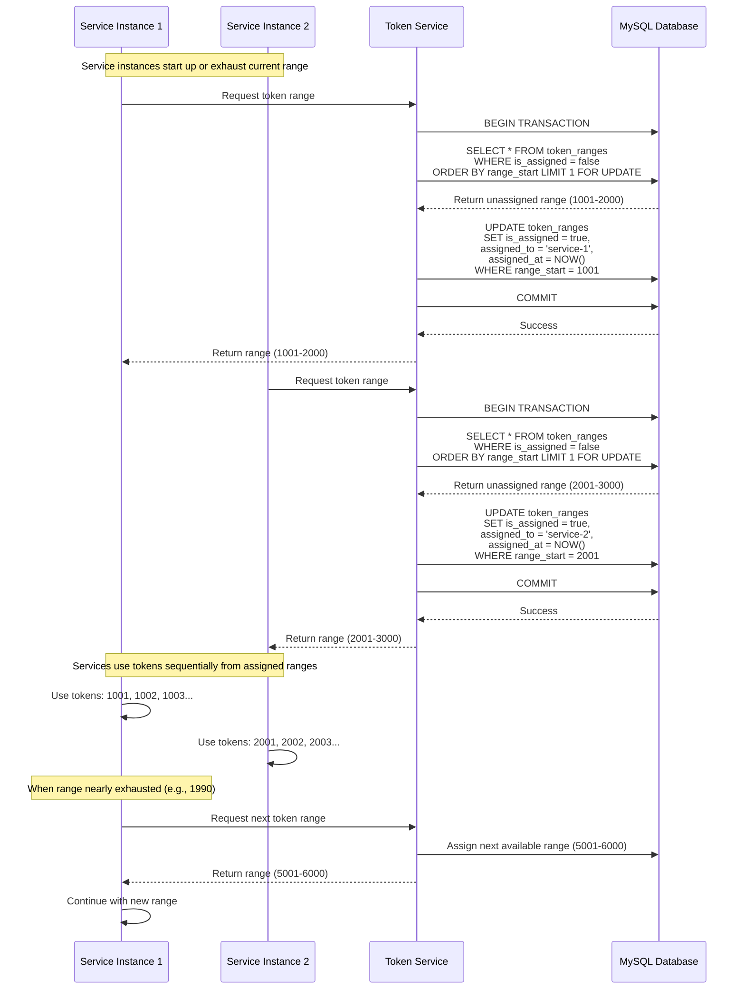

# Sequence Diagram - Token Range Assignment Flow

## Token Range Assignment Sequence

This diagram shows how service instances request and receive token ranges from the Token Service.



## ASCII Fallback

```
Service1 → TokenSvc → MySQL
Service2 → TokenSvc → MySQL

1. Service instances request token ranges
2. Token Service uses ACID transaction
3. SELECT FOR UPDATE ensures no duplicate assignment
4. UPDATE marks range as assigned
5. Return unique, non-overlapping ranges
6. Services use tokens sequentially
7. Request new range when current range exhausted
```

## Key Interactions

1. **ACID Transaction**: Ensures atomic range assignment
2. **SELECT FOR UPDATE**: Prevents concurrent assignment of same range
3. **Non-Overlapping Ranges**: Each service gets unique token range
4. **Sequential Usage**: Services use tokens in order from assigned range
5. **Proactive Request**: Services request new range before exhausting current range

## Concurrency Handling

- **Database Locking**: `SELECT FOR UPDATE` prevents race conditions
- **Transaction Isolation**: ACID guarantees ensure no duplicate assignments
- **Idempotent Requests**: Multiple requests from same service are safe

---

*Previous: [Redirection Flow](./redirection-flow.md)*

