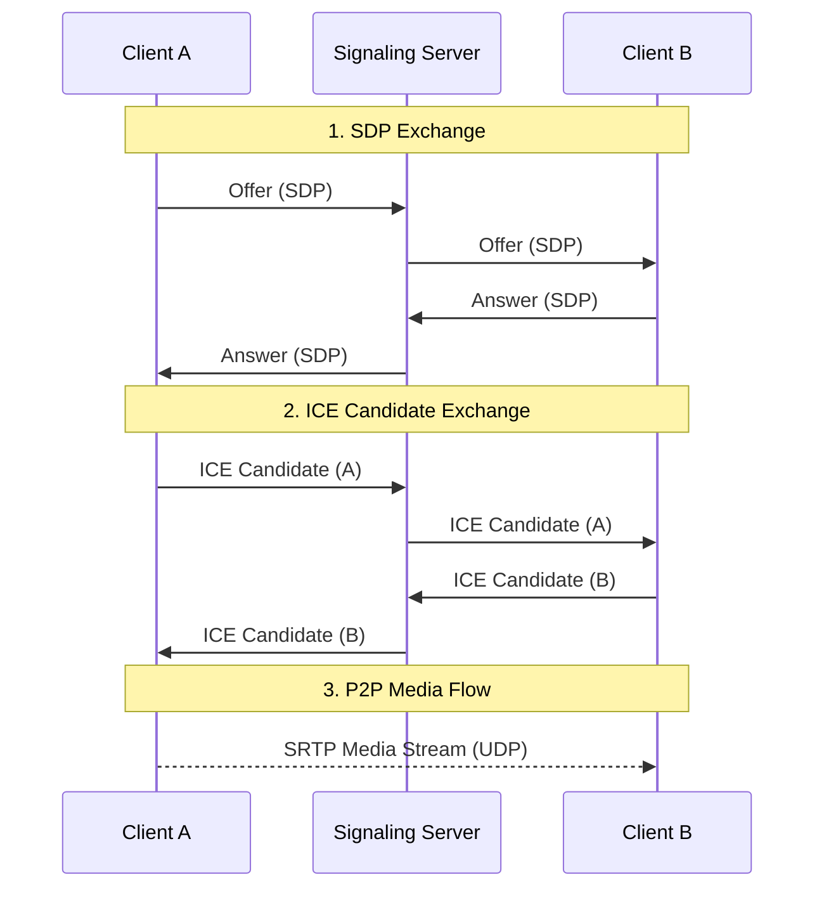

# System Design Deep Dive: Network & Connectivity

## 1. Transport Protocols: TCP vs. UDP

For a video conferencing system, the choice of transport protocol is critical for user experience.

### TCP (Transmission Control Protocol)

* **Characteristics**: Connection-oriented, reliable, ordered delivery.
* **Mechanism**: Uses a 3-way handshake to establish connection. Retransmits lost packets (Automatic Repeat Request - ARQ).
* **Suitability**: Ideal for **Signaling** (call setup, user status) where data integrity is paramount.
* **Drawback for Media**: The retransmission mechanism introduces latency (Head-of-Line blocking). In real-time video, a delayed packet is worse than a lost packet.

### UDP (User Datagram Protocol)

* **Characteristics**: Connectionless, unreliable, unordered delivery.
* **Mechanism**: "Fire and forget". No guarantee of delivery or order. Lower header overhead (8 bytes vs. 20+ bytes for TCP).
* **Suitability**: Ideal for **Media Streaming** (Audio/Video).
* **Why**: If a video frame is lost, it's better to skip it and render the next one than to pause the stream to wait for retransmission.

**Decision**:

* **Signaling**: Secure WebSockets (WSS) over TCP/TLS.
* **Media**: SRTP (Secure Real-time Transport Protocol) over UDP.

## 2. Connectivity & NAT Traversal

Most devices sit behind a NAT (Network Address Translator) and do not have a public IP address. To establish a Peer-to-Peer (P2P) connection, we use the **ICE (Interactive Connectivity Establishment)** framework.

### STUN (Session Traversal Utilities for NAT)

* **Role**: Helps a client discover its own public IP address and port.
* **Flow**:
  1. Client A sends a request to a public STUN server.
  2. STUN server responds with the IP:Port it saw the request come from.
  3. Client A shares this "Server Reflexive Candidate" with Client B via Signaling.
* **Limitation**: Fails with **Symmetric NATs**, where the router assigns different ports for different destinations.

### TURN (Traversal Using Relays around NAT)

* **Role**: Acts as a media relay server when P2P fails.
* **Flow**:
  1. If STUN fails (e.g., Symmetric NAT or restrictive firewall), Client A connects to a TURN server.
  2. TURN server allocates a public IP:Port for Client A.
  3. All media traffic is routed through the TURN server.
* **Trade-off**: Increases latency and server bandwidth costs, but guarantees connectivity.

## 3. The Signaling Process

Before media can flow, clients must exchange metadata via the Signaling Server (WebSocket).

1. **Offer/Answer Exchange (SDP)**:
   * **Caller** creates an **Offer** (Session Description Protocol) containing supported codecs (VP8, H.264), encryption keys, and media capabilities.
   * **Callee** receives the Offer and responds with an **Answer** selecting the compatible parameters.

2. **ICE Candidate Exchange**:
   * As clients discover their network paths (Host, Srflx, Relay), they send **ICE Candidates** to each other.
   * Connectivity checks are performed to find the best path (usually UDP P2P > TCP P2P > TURN UDP > TURN TCP).

## 4. HTTP Tunneling for Restrictive Networks

In some enterprise environments, UDP and even non-HTTPS TCP ports are blocked by strict firewalls or proxies.
In those cases, the normal ICE connectivity ladder (STUN over UDP/TCP, then TURN over UDP/TCP) may fail to
establish a working media path.

To keep the system usable in these "locked down" scenarios, we add an **HTTP tunneling** fallback:

* **Idea**: Encapsulate signaling and, in extreme cases, media packets inside HTTPS requests that look like
  regular web traffic to the proxy.
* **Path**:
  * Client connects to an HTTP tunnel endpoint over `HTTPS :443` (often the same origin as the web app or a
    closely related domain).
  * The tunnel service forwards traffic to the appropriate media gateway or SFU over an internal network path
    that is not subject to the same restrictions.
* **Trade-offs**:
  * Higher latency and jitter compared to native UDP, since packets traverse HTTP stacks and may suffer from
    head-of-line blocking.
  * Increased bandwidth and compute cost, because every packet is serialized through an HTTP relay.
* **Usage policy**:
  * Treat HTTP tunneling as a **last resort**: only enable when standard ICE candidates (P2P via STUN/TURN)
    fail, or for specific high-security tenants that require it.
  * Expose configuration toggles per tenant/region so organizations can decide whether the extra reliability
    is worth the additional cost.

Mentioning HTTP tunneling in an evaluation shows you have an answer for "secure corporate proxy" scenarios
without compromising the UDP-first design for typical networks.
