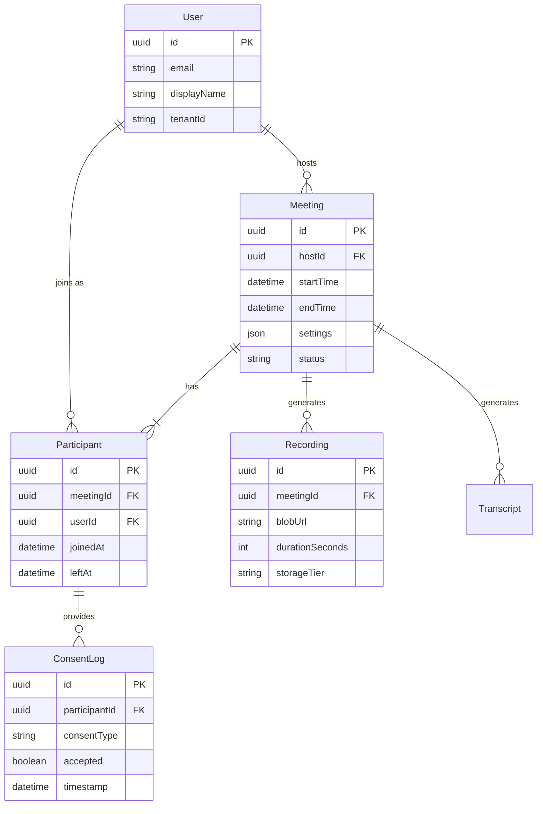

# Detailed Design: APIs and Data Model - Part 1-A

## 1. API Design

The system exposes a set of RESTful APIs for management and signaling, while media streaming uses WebRTC/RTP.

### Meeting Management (REST)

| Method | Endpoint | Description | Request Body |
| :--- | :--- | :--- | :--- |
| `POST` | `/v1/meetings` | Create a new meeting | `{ "hostId": "uuid", "scheduledTime": "iso8601", "settings": { "aiEnabled": true } }` |
| `GET` | `/v1/meetings/{id}` | Get meeting details | - |
| `POST` | `/v1/meetings/{id}/join` | Request to join (returns token) | `{ "userId": "uuid", "password": "..." }` |
| `PUT` | `/v1/meetings/{id}/end` | End the meeting | - |

### User & Consent (REST)

| Method | Endpoint | Description | Request Body |
| :--- | :--- | :--- | :--- |
| `POST` | `/v1/users/consent` | Record user consent | `{ "meetingId": "uuid", "consentType": "recording_ai", "status": "accepted" }` |
| `GET` | `/v1/users/{id}/profile` | Get user profile | - |

### Real-Time Signaling (WebSocket)

* **Endpoint**: `wss://api.meet.com/v1/signal`
* **Events**:
  * `join_room`: Client joins the signaling channel.
  * `offer` / `answer`: WebRTC SDP exchange.
  * `ice_candidate`: Network connectivity candidates.
  * `transcript_update`: Push real-time AI transcriptions to client.

## 2. Data Model

We use a relational database (Postgres) for structured metadata and consistency.

### Entity Relationship Diagram (Mermaid)

### Schema Considerations

* **Sharding**: For scale (2,000+ concurrent meetings), we may shard the `Participant` and `Transcript` tables by `MeetingId`.
* **Indexes**:
  * `Meeting(hostId, startTime)`: For listing a user's meetings.
  * `Participant(meetingId, userId)`: For quick lookup of who is in a meeting.
