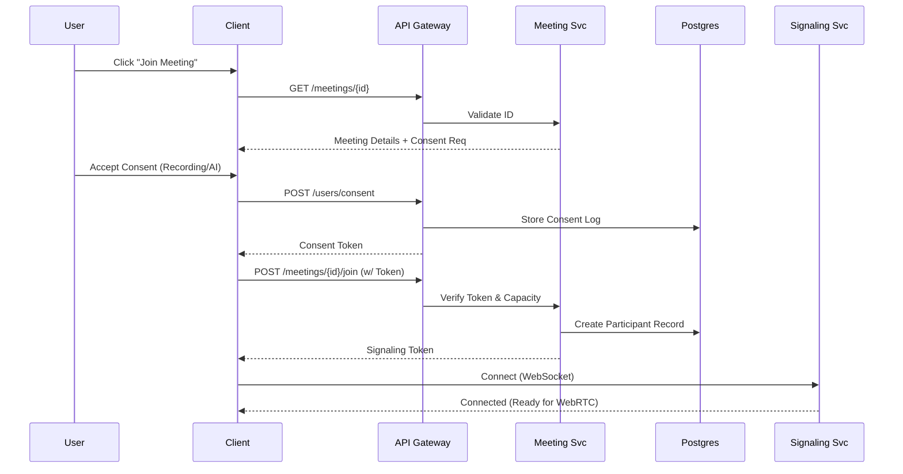
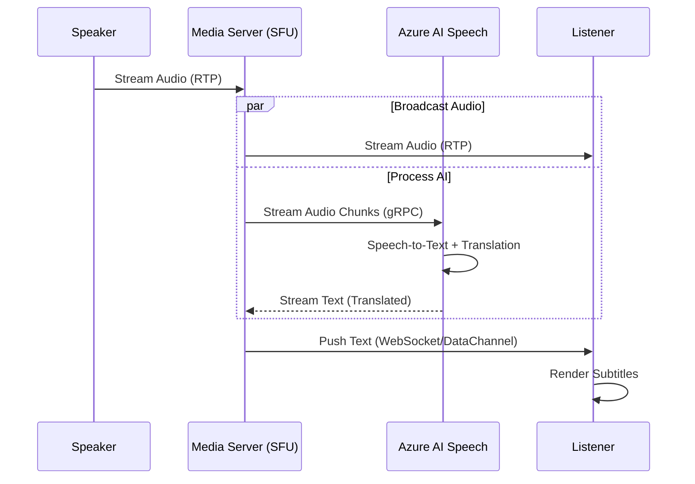

# Detailed Design: Sequences and Capacity - Part 1-B

## 3. Sequence Diagrams

### Flow 1: User Joins Meeting with Consent

This flow ensures compliance before allowing media connection.

### Flow 2: Real-Time AI Translation

This flow demonstrates the low-latency streaming path.

## 4. Capacity Planning

### Assumptions

* **Concurrent Users**: 2,000
* **Video Quality**: 720p (approx. 1.5 Mbps per stream)
* **Audio Quality**: 64 kbps
* **Meeting Duration**: 1 hour average

### Bandwidth Estimation

* **Per User**: 1.5 Mbps (Up) + 1.5 Mbps (Down) = 3 Mbps.
* **Total Bandwidth**: 2,000 users * 3 Mbps = **6,000 Mbps (6 Gbps)**.
* **Implication**: Requires high-throughput networking (Azure Standard/Premium Networking) and potentially CDN for static assets, though media traffic goes through SFU clusters.

### Storage Estimation (Recordings)

* **Video Size**: 1.5 Mbps * 3600 sec = 5,400 Mb ≈ **675 MB per hour**.
* **Total Storage Per Hour**: 2,000 users (assuming 500 meetings of 4 people) -> 500 recordings.
* **Volume**: 500 recordings * 675 MB = **337.5 GB per hour**.
* **Daily Volume (8 busy hours)**: ~2.7 TB / day.
* **Implication**: Aggressive lifecycle management (tiering to Cool/Archive) is critical to control costs.

### Compute (AI Services)

* **Translation**: 2,000 concurrent streams.
* **Quota**: Standard Azure AI tiers may throttle. Need **Provisioned Throughput Units (PTU)** for guaranteed capacity at this scale.
