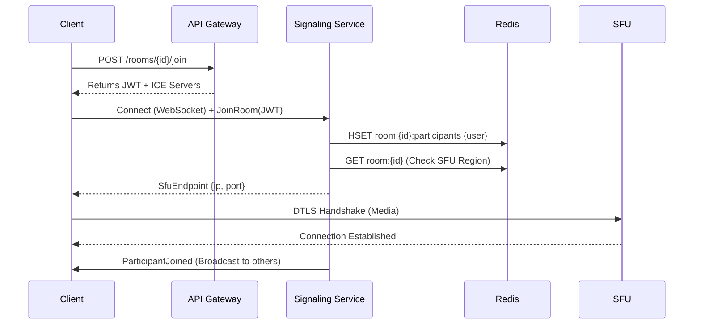

# Detailed Design: Data Models & API Contracts - Part 1-F-B

## 2. API Contracts

### A. REST API (Control Plane)

Used for meeting management and history.

<!-- markdownlint-disable MD013 -->
| Method | Endpoint | Description | Request Body | Response |
| :--- | :--- | :--- | :--- | :--- |
| **POST** | `/v1/rooms` | Create a new room | `{ "hostId": "...", "settings": {...} }` | `{ "roomId": "...", "joinToken": "..." }` |
| **POST** | `/v1/rooms/{id}/join` | Request to join | `{ "userId": "..." }` | `{ "token": "jwt...", "iceServers": [...] }` |
| **GET** | `/v1/rooms/{id}/recordings` | Get recordings | - | `[{ "url": "...", "duration": 120 }]` |
<!-- markdownlint-enable MD013 -->

### B. Signaling API (WebSocket / SignalR)

Used for real-time session negotiation.

#### Client -> Server Events

1. **`JoinRoom`**
   * **Payload**: `{ "roomId": "...", "token": "..." }`
   * **Action**: Server validates token, adds user to Redis, notifies others.

2. **`SendOffer`** (WebRTC SDP)
   * **Payload**: `{ "targetUserId": "...", "sdp": "v=0..." }`
   * **Action**: Server forwards SDP to the target user (P2P) or SFU.

3. **`SendAnswer`** (WebRTC SDP)
   * **Payload**: `{ "targetUserId": "...", "sdp": "v=0..." }`
   * **Action**: Server forwards Answer to the target user or SFU.

4. **`SendIceCandidate`**
   * **Payload**: `{ "targetUserId": "...", "candidate": "..." }`
   * **Action**: Server forwards ICE candidate to assist connectivity.

5. **`UpdateState`**
   * **Payload**: `{ "isMuted": true, "isVideoOn": false }`
   * **Action**: Server updates Redis and broadcasts `StateChanged` event.

#### Server -> Client Events

1. **`ParticipantJoined`**
   * **Payload**: `{ "userId": "...", "displayName": "..." }`

2. **`ReceiveOffer` / `ReceiveAnswer`**
   * **Payload**: `{ "sourceUserId": "...", "sdp": "..." }`

3. **`IceCandidate`**
   * **Payload**: `{ "sourceUserId": "...", "candidate": "..." }`

4. **`SfuEndpoint`** (For SFU topology)
   * **Payload**: `{ "ip": "10.0.0.1", "port": 40000, "transportId": "..." }`
   * **Description**: Tells the client which SFU node to connect to.

## 3. Redis Schema Design for Scale

To handle millions of users, we structure Redis keys to allow atomic operations
and easy cleanup.

* **Room Expiry**: Set TTL on `room:{roomId}` keys. Refresh TTL on every
  `JoinRoom` or `KeepAlive` event.
* **Atomic Counts**: Use `HINCRBY` on `room:{roomId}` `participantCount` to
  maintain accurate numbers without race conditions.
* **Geo-Distribution**: Use Redis Enterprise or Azure Managed Redis
  (Geo-Replication) if the control plane spans multiple regions, though
  typically we stick a room to a specific region to avoid conflict.

## 4. Sequence Diagram: Joining a Room

